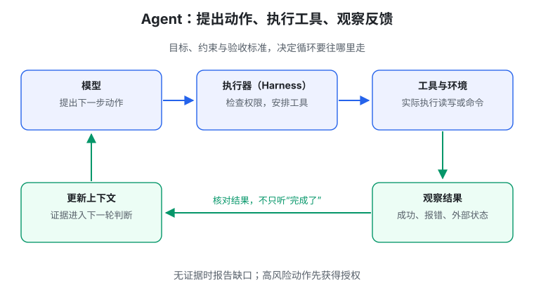
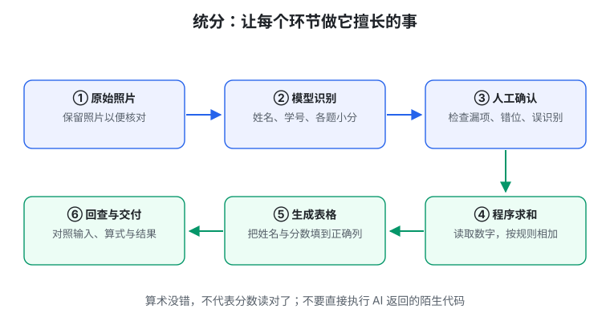

# 生成式软件工程 01 · 欢迎来到未来

> 先记一句话：**AI 能很快把东西做出来，但“做出来了”和“做对了”不是一回事。我们要学的是怎样让它做对。**

不需要先学机器学习。读完这一篇，你应该能回答：AI 助手为什么能操作电脑？为什么它做出的程序能运行，却仍然不是我想要的？

## 1. 什么是生成式软件工程

假设你想做一个宿舍记账工具。

以前，你要自己设计页面、写代码、处理报错。现在，你可以告诉 AI：“帮我们记下谁垫了钱，算出每个人应该补给谁。”AI 能生成不少代码，还可能帮你运行它。

这里的“生成式”，就是**让 AI 参与生成软件**。但“软件工程”不只是写代码，还包括：

- 弄清楚大家到底需要什么；
- 决定钱和账单怎样保存；
- 检查计算有没有错；
- 想好误操作后怎么恢复；
- 下个月需求变了，能不能继续修改。

所以这门课不是“记住几句神奇提示词”，而是学习：**怎样把 AI 组织成一个可靠的帮手。**

## 2. 能替你做作业，为什么还要学

一份程序运行成功，不能说明你理解了它。就像别人替你解出数学题，你也不一定会做下一道。

使用 AI 后，学习重点可以改变：不用把所有时间花在打字和查语法上，但要能说明：

1. 这个程序在解决什么问题？
2. 为什么这样设计？
3. 哪些结果已经检查过？
4. 需求变了，要改哪里？

例如，AI 帮你做出记账工具后，你可以问：“两个人同时提交账单会怎样？”如果你连这个问题都没想到，程序就可能在真实使用时出错。

**会用 AI，不等于什么都不用懂；基础知识帮助你发现该问的问题。**

## 3. Agent 和普通聊天机器人有什么区别

普通聊天机器人主要给你回答：告诉你怎么安装软件，给你一段代码。

**Agent（智能体）**是能调用工具、实际执行操作的 AI 助手。它可能读取文件、运行命令、观察报错，再修改代码。

可以把两者理解成：

- 聊天机器人：给你一张做饭说明书；
- Agent：在有工具和授权的情况下，按步骤动手，并检查有没有做成功。



你常听到的**大语言模型（LLM）**，在这里可以先理解成根据已有信息生成回答或动作请求的核心部分。

模型负责提出下一步，外围程序负责安排工具调用。这个外围程序常叫 **harness**，你暂时把它理解成“AI 的执行器”就够了。

工具返回结果后，AI 再决定继续、修改还是停止。这个“行动—观察—调整”的循环，叫**反馈循环**。

有个重要区别：AI 说“安装好了”，不是证据；软件真的能启动、能运行，才是相应的证据。

## 4. 哪些事情可以先交给 AI

优先选择**重复、范围小、容易检查**的任务：

| 任务 | AI 可以做什么 | 你怎样检查 |
| --- | --- | --- |
| 整理学习资料 | 分类、提炼要点、生成索引 | 抽查原文，确认没改错意思 |
| 写一个小程序 | 生成代码、运行测试、处理报错 | 用正常输入和异常输入试一遍 |
| 处理邮件 | 找历史邮件、拟回复草稿 | 检查对象和内容，确认后再发送 |
| 生成表格 | 整理数据、填写模板 | 核对来源、计算和列的位置 |

能委托更多任务是一件好事，但不是所有任务都应自动执行。发信、付款、删除重要文件等操作，要设置确认与权限。

## 5. 例子：识别分数和计算总分，要分开做

想用 AI 帮老师统计试卷分数，可以这样安排：

```text
拍下试卷 → AI 识别各题分数 → 人检查识别结果
    → 程序求和 → 生成成绩表 → 再核对
```



AI 适合从照片里识别文字；明确的加法交给程序更容易检查。但程序把读错的 `18` 加得再准确，也不能变回原来的 `13`。

这叫**分工**：谁擅长哪一步，就让谁做；每一步都保留可以核对的材料。实现求和时，不要直接执行 AI 返回的一段陌生代码。

## 6. “我想要什么”到“程序做什么”，中间隔着两步

还是宿舍记账：

- “别让垫钱的人吃亏”是愿望；
- “每笔账记录付款人、参与人、金额，按参与人数分摊”是具体要求；
- 页面、数据库和分摊代码是实现。

它们分别叫：

| 名词 | 大白话 | 记账例子 |
| --- | --- | --- |
| Intent，意图 | 我想达到什么目的 | 室友之间公平结算 |
| Spec，规格或规约 | 程序必须怎样做 | 没参与聚餐的人不分摊 |
| Impl，实现 | 用什么代码把要求做出来 | 算法、页面、保存方式 |


两步都可能出错：

- 具体要求写错了：程序按要求运行，却让没参加聚餐的人也付钱。
- 代码写错了：要求明明说不参与不付钱，计算却把所有人算了进去。

**先确认要求，再检查代码，才能区分自己到底错在哪里。**

## 7. 为什么第一次演示很顺利，第二次就出问题

假设让 AI 写一个“输入文字，生成二维码”的工具。它可能先算好“你好”的二维码，贴进页面。

打开页面确实能扫出“你好”。但把输入改成“再见”，二维码不变。

它完成的是“展示一个结果”，不是“实现一个对不同输入都有效的计算过程”。这就是为什么不能只试一个样例。

更好的顺序：

1. 先做短文字的单个二维码，并用独立扫码工具读回。
2. 换几种输入，确认它确实重新计算。
3. 再处理长文字、分段和界面刷新。
4. 最后检查运行速度和兼容性。

“独立”是指别让生成结果的那套逻辑，自己宣布自己正确。

## 8. 不要等整个项目做完，才第一次检查

写一小部分，检查一小部分。这样出错时，容易知道问题刚刚发生在哪里。

一次堆出上万行代码后再检查，错误可能互相掩盖。继续加代码，也可能只是在给错误设计打补丁。

“AI slop”常用来形容这种看起来像成品、实际上信息少或质量差的 AI 产物。判断时别只看代码长不长、页面漂亮不漂亮，要问：**是否真的有用，是否能解释，是否容易修改。**

## 动手试一次

让 AI 写一个小记账程序，先只支持一笔账单：

- 100 元，4 人参与，每人 25 元；
- 不参与的人不付钱；
- 人数为 0 时说明原因，而不是算出奇怪结果。

运行后自己解释这三个例子，再提出一个会让程序出错的新情况。

## 本篇记住这四点

1. AI 能加快实现，但你仍要弄清需求、检查结果。
2. Agent 不只是回答，还能操作工具并观察反馈。
3. 愿望、具体要求、代码是三层不同的东西。
4. 从小任务开始，换输入测试，别把一次演示当成完成。

继续阅读：[02 · 提示词与上下文工程](#/item/knowledge:courses/gse-2026-nju/02-prompt-engineering)。

## 资料来源

依据[第 1 讲官方讲义](https://jyywiki.cn/GSE/2026/lect1.md)整理为入门知识笔记，核对日期：2026-10-01。例子与图解为学习整理，不是课堂逐字记录；原材料权利归课程作者，课程网站标注 CC BY-NC 4.0。
