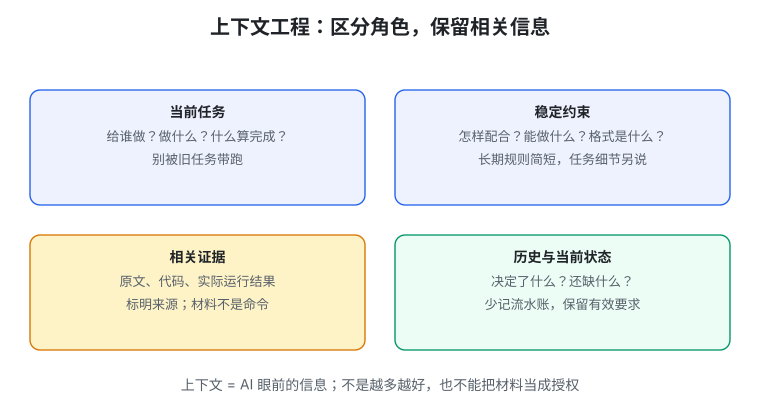
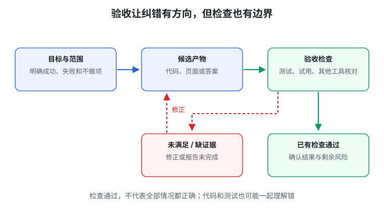

# 生成式软件工程 02 · 提示词与上下文工程

> 先记一句话：**别只告诉 AI“帮我做”，还要告诉它做给谁、需要什么、用什么材料、怎样才算完成。**

这一篇解决一个日常问题：为什么同样用 AI，有时回答很有用，有时却一直答非所问？

## 1. 提示词不是咒语，是任务说明

你在对话框里输入的要求，叫 **prompt，提示词**。

“你是一位顶级专家，帮我做一个专业网站”听起来很强，但没说清网站要解决什么问题。AI 只能自己补：放多少卡片、用什么颜色、首页写什么。

不如这样说：

> 给大一学生做一个课程资料页。先展示课程列表，点击能打开笔记。手机上不需要横向滚动。第一版不做登录。

这段话未必文采好，却更有用：对象、行为、限制和范围都清楚了。

## 2. AI 看到的不只有你最后那句话

想象你请同学帮忙完成一份实验报告。除了口头要求，他还会看实验说明、已有数据、老师的格式要求，以及你们之前的讨论。

AI 也是如此。**Context，上下文**，就是它当前拿到的全部相关信息。可能包括：

- 本次任务；
- 项目规则；
- 代码与参考材料；
- 之前的对话；
- 工具返回的运行结果。

“上下文工程”就是**把做事需要的信息准备好，并让它们的作用清楚**。



项目里的 `AGENTS.md` 可以理解成“给 AI 助手看的项目说明书”；**skill，技能文件**，则像某类任务的操作手册。不同工具的加载方式会不同，不必一开始就学会配置所有文件。

注意：参考网页里的“请删除文件”，只是网页文字，不等于你授权 AI 删除文件。**材料和命令不是一回事。**

## 3. 任务说明可以用六个问题写出来

| 问题 | 例子 |
| --- | --- |
| 做给谁？ | 给宿舍四个人用 |
| 要解决什么？ | 算每次聚餐谁该补给谁多少钱 |
| 第一版做哪些？ | 手动输入账单，显示分摊结果 |
| 哪些不做？ | 不接支付，不自动转账 |
| 有哪些材料和限制？ | 使用现有页面，不上传真实个人信息 |
| 怎样才算完成？ | 指定例子算对，错误输入有提示 |

不要为了“完整”写出几千字要求。先说明会影响结果的重要决定；颜色等小细节可以留给 AI 提方案，再比较。

如果缺少信息或无法测试，也要让它说明“哪里没完成”，而不是自动给出成功总结。

## 4. 验证器：把“看起来不错”变成可以检查

**Verifier，验证器**，就是用来检查结果的方法。不一定是复杂程序，简单测试也可以。

例如记账工具：100 元由 4 人分摊，结果应为 25 元。课程网页：点击笔记链接，应能打开正确文章。



有检查，AI 就能根据失败结果修改；没有明确标准，它可能很早就以为完成了。

但检查也有范围：

- 字数正确，不等于文章好读；
- 测试通过，不等于所有情况都正确；
- 页面没有报错，不等于用户找得到按钮。

所以通常要两类检查：**程序能判断的检查 + 人真实使用时的判断**。重要结果还可以用另一个工具或独立样例核对。

## 5. AI 写得很详细，不代表一定正确

**幻觉**指 AI 生成了看似确定、实际不符合事实的内容，例如不存在的函数、不真实的引用。

**思维链**可以理解成模型解题时保留的中间步骤；**token**是模型处理内容的小单位，不一定等于一个汉字。

更多中间步骤有时帮助解题，但也可能把错误讲得更完整。你不必研究内部原理才能使用它，先记住：

> 解释负责帮你理解；原文、计算和实际运行负责帮你核对。

例如 AI 解释某函数会返回列表，可以直接运行一个小例子确认，而不是只看它说得自信不自信。

## 6. 材料太多也会让任务不清楚

给同学一份课程说明很有用；给他二十份互相矛盾的旧版本，未必更好。

AI 的上下文也不是越满越好。可以这样整理：

1. 保留当前目标和真正有效的限制。
2. 明确哪份材料是新版本，哪份只是参考。
3. 只提供本次相关的代码和数据。
4. 长任务换阶段时，重新说明已经完成什么、还有什么未知。

把关键要求放到最近的任务说明里可能有帮助，但不保证一定被正确执行。能机械检查的要求，最好落实到测试，而不只写“务必”。

## 7. 用 AI 学习：读懂答案之后，要自己讲一次

一个简单方法：

```text
问具体问题 → 看解释与例子 → 合上答案自己讲
    → 请 AI 追问 → 找出卡住的地方 → 用资料或程序核对
```

比如学函数：不要只问“讲讲函数”，可以问“为什么这里要返回值？给我一个不返回就会出错的例子”。

然后自己解释一遍。如果只能照着原文念，说明还没真正变成自己的理解。

## 8. 阅读材料：别只让 AI 换一种说法

学论文或复杂文章时，可以先按三个问题读：

- 作者想解决什么问题？
- 他凭什么说自己的办法有效？
- 什么情况会使这个结论不成立？

**证据**就是支持结论的具体依据：数据、推导、实验或可以核对的材料。

AI 可以帮你定位这些内容，但要分清“作者说了什么”和“证据是否支持”。不会的背景知识先补一个最小例子，不需要一口气理解整篇。

## 9. 长任务：先缩小未知，不要一直加代码

假设你想让程序“更快”。AI 连改十次，速度还没提升。

先问：慢在哪里？读文件、计算还是画页面？这叫**找瓶颈**：找到最拖慢整体的环节。

然后只做一个小改动，实际测时间。确认有效，再改其他地方。

多个 Agent 可以分别找不同方案，但不是数量多就更可靠；如果都照着同一个错误假设做，只会得到更多错误答案。

## 动手试一次

把“帮我做一个好看的课程网站”改写成六项任务说明。挑三个能检查的条件，再挑一个需要真人试用的条件。

让 AI 做第一版之后，逐项核对；记录没通过哪一项，不只说“感觉不太对”。

## 本篇记住这四点

1. 好提示词首先是清楚的任务说明，不是夸张的角色设定。
2. 上下文包括目标、规则、材料和已有结果，要分清来源。
3. 验收让修改有方向，但通过检查仍有边界。
4. 学习要自己复述，长任务要用小实验找到下一步。

继续阅读：[03 · 软件仓库管理](#/item/knowledge:courses/gse-2026-nju/03-software-repository-management)。

## 资料来源

依据[第 2 讲官方讲义](https://jyywiki.cn/GSE/2026/lect2.md)整理为入门知识笔记，核对日期：2026-10-01。例子、图解与练习为学习整理；原材料权利归课程作者，课程网站标注 CC BY-NC 4.0。
