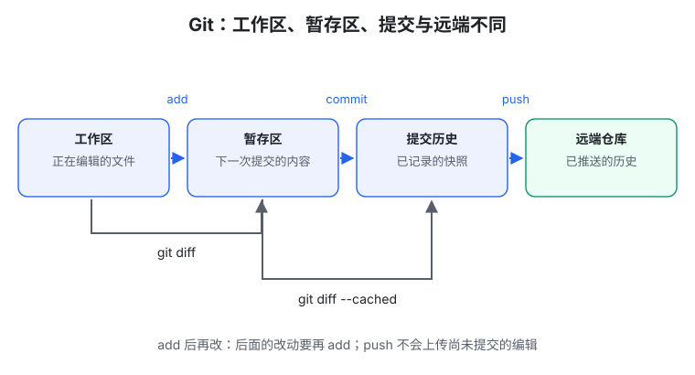
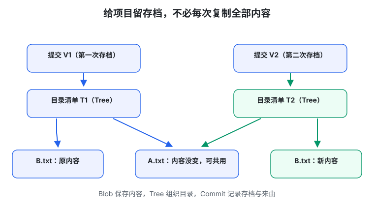

# 生成式软件工程 03 · 软件仓库管理

> 先记一句话：**Git 帮你给项目留存档，让你知道改了什么，出错能回查，多人开发能汇合。**

这一篇先讲日常用法，再讲一点内部结构。内部结构可以第二遍再看，不影响先学会安全保存项目。

## 1. 为什么“作业最终版”不是好办法

你可能有这些文件夹：

```text
作业第一版/
作业最终版/
作业最终版2/
作业真的最终版/
```

这样可以留下旧文件，但很快会忘记：哪一版能运行？两版有什么区别？哪个是同学修改过的？

**版本管理**就是有条理地保存和比较这些变化。Git 是一种版本管理工具；**仓库（repository，简称 repo）**就是交给 Git 管理的项目。

GitHub 是放远端仓库、交流和协作的网站，和 Git 不是同一个东西。本地也能使用 Git，不需要每次提交都联网。

## 2. 快照：给整个项目拍一张“内容照片”

**Snapshot，快照**，记录某时刻被管理的文件内容和位置。它不是屏幕截图，而是文件状态的存档。

为什么不只保存代码？因为代码、配置、接口可能需要配套。只恢复旧代码却留下新配置，可能得到一个从没正常运行过的组合。

**Commit，提交**，就是把一个快照连同说明和历史关系记录下来。你可以用说明知道这一步为什么改。

这里的“完整快照”是理解方式，不代表每次复制整个目录。Git 会复用没变的内容，也可以压缩存储。

## 3. 四个位置别混：编辑、准备存档、正式存档、上传



| 名词 | 大白话 |
| --- | --- |
| 工作区 | 你此刻正在编辑的文件 |
| 暂存区（Index） | 选好准备放进下一次存档的内容 |
| 提交历史 | 已经正式记录的存档 |
| 远端仓库 | 同步到另一台机器或托管平台的历史 |

最常见流程：

```bash
git status                 # 看哪些文件变了
git diff                   # 看还没暂存的修改
git add notes.md           # 选入这个文件此刻的内容
git diff --cached          # 检查准备提交的修改
git commit -m "docs: 补充学习笔记"  # 创建存档
```

仓库配置好远端和分支之后，再用 `git push` 推送。

**`add` 保存的是当时内容。** 如果 add 之后又改文件，后面的改动不会自动进这次提交，需要再 add。

**`push` 只推送已提交历史。** 它不会替你备份工作区里尚未提交的编辑。

## 4. 初次建立仓库，两个入口

- 已经有一个本地项目：`git init`，开始建立版本管理。
- 想拿到别人已有的仓库：`git clone <仓库地址>`，下载副本与历史。

之后先用 `status` 观察，再决定下一步。`git pull` 会获取远端更新并按配置进行整合，不是“无条件覆盖成本地最新文件”。

遇到不懂的操作，可以让 AI 解释：**会改文件吗？会改历史吗？有没有影响别人？** 不要直接复制一串自己不知道后果的命令。

## 5. 每次提交做一件能说明白的事

“修复分摊金额”是一件事；“修复金额、换主题、升级依赖、重排文件”混在一起，就很难检查。

这种围绕一个目的组织的完整修改，叫**原子变更（atomic change）**。它可以涉及多个文件，不是只允许改一行。

例如修计算错误，最好同时补一个会暴露旧错误的测试。它们都服务同一目的，可以一起提交。

提交说明可以写：

```text
fix(split): 修复未参与者也被计入分摊的问题
```

`fix` 表示修错误，`split` 表示相关部分。这个格式属于 Conventional Commits，一种常见约定，不是 Git 强制要求。最重要的是别人看得懂这一步的目的。

及时保存探索过程；准备与别人整合时，再按项目规则整理成容易理解、尽量能运行和测试的步骤。

## 6. 分支：从同一份存档试两条路线

假设你想改首页，同学想修计算。**Branch，分支**，让你们从同一起点各自推进。

之后有两种常见汇合方式：

- **Merge，合并**：把两边的成果整合，通常保留分叉的历史。
- **Rebase，变基**：把一边的改动放到新的起点上重新应用。


Merge 不会自动把同学的作者信息抹掉。Rebase 通常产生新的提交编号，所以不要擅自重写别人已经依赖的历史。

如果两个人改了同一段文字，Git 不知道选谁的，可能留下**冲突标记**。先看 `status`，再根据需求编辑成正确内容，不能简单删除标记就算解决。

而且**没有文字冲突，不等于组合一定正确**：你改了返回格式，同学的页面还按旧格式读取，文件不同也照样会出错。

## 7. 什么不应该提交

通常提交：源码、测试、构建说明、团队共享配置。

通常不提交：运行日志、缓存、私人设置、可重新生成的产物，以及任何密钥或私密数据。

`.gitignore` 是忽略清单，告诉 Git 某些未跟踪文件通常别加入管理。它不是橡皮擦，不会删除旧历史，也不会自动取消已经跟踪的文件。

生成文件也有例外：例如依赖锁文件记录程序用到的其他软件的具体版本，常常需要提交。要问“这个文件有没有共同维护的价值”，不要只按文件名机械判断。

误提交密钥时，先撤销或更换密钥，再处理历史；只删掉当前文件不够。

## 8. 出错了，怎样利用历史

先保护现场，再判断需要哪种恢复，不要急着执行破坏性命令。

| 工具 | 帮你回答什么 |
| --- | --- |
| `git log` | 项目经历了哪些提交？ |
| `git show` | 某次提交具体改了什么？ |
| `git blame` | 当前这行来自哪次历史修改？ |
| `git bisect` | 哪一步开始出现这个可重现的问题？ |
| `git revert` | 怎样用新提交撤销某次变化？ |

`bisect` 可以理解成不断试中间存档，缩小好版本与坏版本之间的范围。前提是你能稳定判断“有没有这个 bug”；随机出现的故障会更难定位。

`blame` 的名字像“责怪”，实际更有用的是查来由，不是自动宣布谁该背锅。

## 9. 进阶一点：Git 怎样避免反复复制整个项目

这一节只要看懂图，不必背格式。



Git 内部的三个关键名词：

- **blob**：保存文件内容；
- **tree**：像目录清单，连接文件名和内容；
- **commit**：连接项目目录状态、父提交与说明。

只改 `B.txt`，`A.txt` 就能继续引用原来的内容。树状目录里，受影响的目录也会得到新表示。

“Git 以快照理解历史”不等于“永不使用差分”。**差分（delta）**是用“和旧内容相比变了什么”来帮助存储或表示变化，Git 的打包存储也可以用它。

## 10. 交给 AI 也要分清完成到哪一步

下面几句话不是同一回事：

```text
代码写完 → 本地测试通过 → 提交完成 → 推送完成 → 部署完成
```

**部署**是把程序放到别人能够访问或使用的运行环境。你电脑上的 `localhost` 页面通常只对本机有效，不等于公开网站。

可以让 AI 完成这些步骤，但每一步都要看相应结果，而不是只看最后一句“全部完成”。

## 动手试一次

在一个专门练习的空目录中：

1. 建仓库，写一个文本文件。
2. add 后再次编辑，比较 `diff` 与 `diff --cached`。
3. 提交后用 `show` 确认保存了哪个版本。
4. 做第二个小改动，用 log 和 show 比较两次存档。

练习用虚构材料，不在重要共享仓库里随意重写历史。

## 本篇记住这四点

1. Git 记录的是项目快照和历史关系。
2. 保存文件、暂存、提交、推送是不同步骤。
3. 小步提交围绕一个目的，比较和恢复都更容易。
4. 合并和推送不能代替测试与部署检查。

继续阅读：[04 · Traceability 与 jj](#/item/knowledge:courses/gse-2026-nju/04-traceability-jj-agent-vcs)。

## 资料来源

依据[第 3 讲官方讲义](https://jyywiki.cn/GSE/2026/lect3.md)整理，核对日期：2026-10-01。工具细节可查 [Git add](https://git-scm.com/docs/git-add)、[Pro Git 对象模型](https://git-scm.com/book/en/v2/Git-Internals-Git-Objects)。图解与练习为学习整理；原课程材料权利归作者，课程网站标注 CC BY-NC 4.0。
