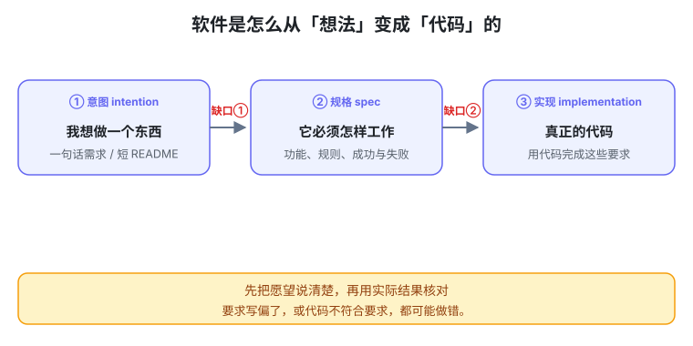
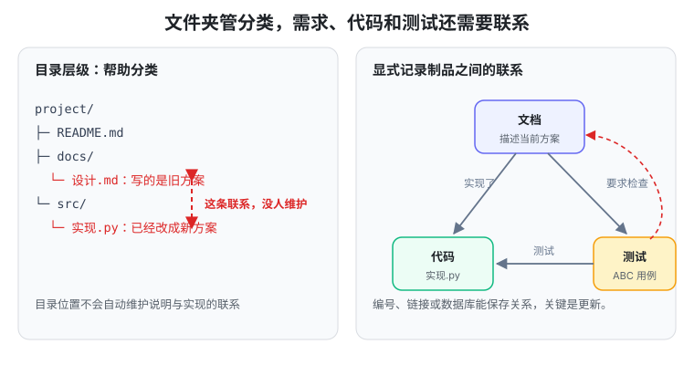
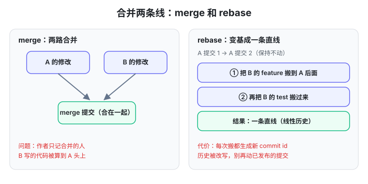
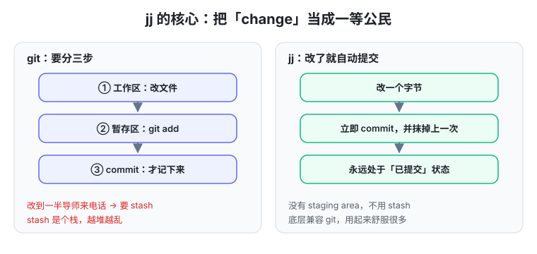
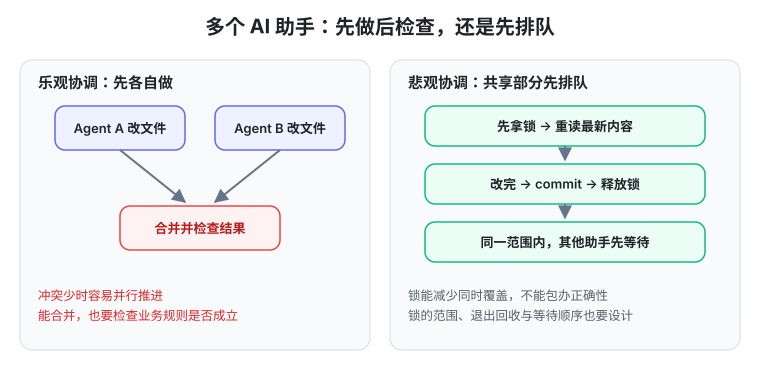

# 生成式软件工程 04 · 软件仓库管理（2）：Traceability 与 jj

> 一句话：第三讲讲的是"用 Git 把项目组织成小步快照"，第四讲往前推了一步——**文件系统本身装不下软件里的关联（traceability），所以先看未来的 repo.db 长什么样，再看 git 的毛病（merge/rebase/staging），引出 jj 的 change，最后回到本课正题：当 agent 以秒级产生提交时，版本控制该怎么重新设计。**

## 开场：Lab 1「会成长的个人助手」与焦油坑

第四讲发布 Lab 1：做一个**会成长的个人助手**。作业只给方向，不限做法：

- 个人学习数据库（把计网、概率论等资料、论文、教科书整理进去）
- 个人信息自动填表（姓名/学号/身份证/简历，"一句话把这个填了"）
- 邮箱联动（always on 的后台 agent，替你收邮件、回邮件）
- 一卡通事务（对 agent 的一次"子进程式调用"）
- 手机端联动（网页或 app，让 agent 自己下好依赖做出来）

蒋炎岩布置这个 lab 的用意，是让你**亲手踩一次焦油坑**：直接把需求丢给 AI，它一开始就会做出一堆"看起来也合理"的决定，然后项目越改越难维护，直到你 token 越烧越多、最后下定决心删掉重做。他还预告：下一个 lab 会和这个 lab 强关联且互相冲突——"你一点一点去改，越改越崩溃"，那才是真正的软件工程体验。

## 回顾：项目是文件的集合，README 就是 intent

上一讲的结论是**项目 = 目录 + 一堆文件**。这一讲补充一个关键点：**README 该写什么**。

他不喜欢 AI 写出的超长 README。README 应该只写三样：**初衷**（想做个什么产品）、**效果**（配两个截图）、**最重要的设计**。打比方：你要创业说服他入伙，只需要一个短 README 讲清 intent；spec、数据库、怎么从 1 用户撑到 1 亿用户，这些 computer science 的能力他都能补——**你只要那个最原始的 intent**。

于是主线模型再次出现：**intent → spec → implementation**，中间有巨大的 gap，而“AI 只能看到你写下来的那一部分”。

## 文件系统的历史包袱：关联丢了 = 技术债

大家用文件系统管项目，**纯粹是历史原因**：1950、60 年代操作系统只给你文件，关系型数据库还没发明。但文件系统**丢了很多它表达不了的信息**——意图、spec、测试这些都好放，问题是**项目里大量隐藏的关联没有地方放**。

经典例子：你让 AI 把 `linked list` 优化成 `tree`，代码改了；但某个 markdown 文档里写过"数据用 linked list 管理"。于是文档、代码、测试之间就形成了一条**没人维护的关联**——写文档时可能还没代码，代码实现后这条关联又没被强行连上。这就是**技术债**：文档和代码越推演越不一致，最后你拿出代码，根本不知道"文档对还是代码对"——聊天记录没了、换电脑了，git 日志里也看不出这条关联。

## Traceability 与 repo.db：软件应该是一个有环的图

这其实是软件工程研究了很久的问题，叫 **traceability（可追踪性）**：项目里各种测试用例、文档、甚至文档里的一行代码，**它们之间的关联是什么？能不能在软件演进中一直维持？**

他的设想是:把软件拆成一个个**对象/实体**,然后显式地连关系--"这段代码实现了这个文档""这个测试用例测试这段代码""这个文档细化了那个文档"。这是一个**随便连接、有 cycle 的图**,文件系统的树状结构装不下它。于是可以放到数据库里，叫 **repo.db**——人类用 UNIX 工具维护不了了，但**用魔法打败魔法**：只要给 AI 强化学习的反馈信号，就能训练 AI 理解这个 repo。

每次你也不是"把产品变成另一个产品"，而是给它**加一个功能、改一个功能**——这和 git"小步前进"的哲学是一样的。

## content as code：为"这一小步"生成一个 VIEW

git 管理的是快照和快照之间的关系，主张**小步前进**。延伸到 repo.db 上：每次跟 AI 说"这里有个 bug""这个幻灯片样式不满意"，这就是**一小步**；而一个大型软件系统里**绝大部分内容和这一小步无关**。

既然无关，就让 AI 根据你的 chat，把相关的东西摘出来，**动态生成一个和这一小步相关的 view**——借用的就是数据库里"视图（view）"的概念：数据还是那些数据，只是换个形式展示。你看到的不是代码，而是一个**可视化看板**，改完后再从 V0 落到 V1 的 repo.db，把相关联的文档/代码/测试一起改掉，从"一个一致状态"做一次小步修改到"下一个一致状态"。

他顺势点题：这些思考用的全是经典 CS 概念——数据库的**实体与关系、视图**，git 的**小步前进**。如果这个模型下"大步向前"，就会惨。

## Git 回顾：merge 的作者权困境 vs rebase 的代价

回到 git：它管理**快照**，两个开发者各自在快照上开发，要合并时有两条路：

- **merge（两路合并）**：创建一个有两个 parent 的 merge commit。问题：**作者权被改写**——由 A 来合并，那 B 写的、冲突解决时改动的内容，ownership 都记到 A 头上。
- **rebase（变基）**：不直接并线，而是试着把 B 的 feature、test **逐个搬到 A 的历史后面**，成功就是线性历史。**风险**：一旦冲突就要进入 rebase 模式，搬 test 时还可能再失败；而且**每次 rebase 都创建新 commit id**，历史被改写。

关键洞见：**我们真正关心的是“修改（change）”，但 git 里没有 change 这个对象——修改是用 commit 及其 parent 的关系来替代的。**

## jj（Jujutsu）：把 change 变成 first-class citizen

如果把 change 也变成一等公民，就发明了下一代 VCS——**jj**：

- 底层和 git 完全兼容，可以直接当 git 用；
- 上面增加 **change** 概念：rebase 时直接**把 change 搬过来**，冲突也作为 change 的一部分一路带下来、到这里再 resolve；
- **没有 staging area**:git 最烦的场景是"hello.c 改到一半不能编译,导师连环电话要你先修别的 bug"--你要 `git add` + `git stash`,而 stash 是个**栈**,越堆越乱。jj 的做法是：**你每改一个字节，它立即做一个 commit，并抹掉上一次的那个提交**——你永远处于“已提交”的 change 状态，连 staging 都不需要。

## 肌肉记忆与学习顺序

一个很实用的学习建议：**在还没形成肌肉记忆时，直接去用"更正确"的那个设计**。老一代有 SVN 肌肉记忆、他这一代有 git 肌肉记忆——一旦形成就很难掰回来；而初学者可以直接从 jj 的 change 开始理解，先记住最正确的设计，再回头理解"原来 git 这么蠢"（SVN 存 delta 走错路 → git 存快照很先进 → 到今天 git 也有一些设计错误，比如没预见到 rebase 的 impact）。

## 人是单线程的：VCS 的隐藏假设被 agent 打破

这才是本课（**生成式**软件工程）的正题：在 agent 时代重新设计版本管理。所有传统 VCS 都有一个隐含假设——**使用者是单线程的人**：一双手、一张嘴、一对眼睛，读和写不能同时。所以人产生 commit 的节奏是**小时级、10 分钟级**，团队靠每天开会划分 scope；stash 这种设计在人手里"栈通常只有一层"，是合理的。

但 agent 是**秒级**产生原子提交，还能轻易扩到 10 倍、100 倍的 agent team——为单线程人类设计的 git/jj 就跟不上了。

## 一个 agent 一个容器 / worktree / 告别 blame

- **一个 agent 一个容器**：把每个 agent 想象成单线程的人，给它一台隔离的机器（tmux session），向里面 inject 命令。现场演示 master/slave：主座位看输出、总结报告、inject prompt；强模型互相对抗（Codex 设计、Claude review）。不同 repo 完全可以协作，冲突了 agent 自己修，必要时给 master 发消息。
- **git worktree**：比多台虚拟机更轻量的并行协作。`.git` 除了是目录，还可以是一个写着 `gitdir: ...` 的**文本文件**，指向一个微型的 git 目录——worktree 里可以独立提交、本地互相可见，不用反复 pull/push。
- **告别 blame**：git bisect、git blame 都是**为人设计**的——人可以被 blame、被开除、被背锅。agent 没有"坐牢的能力"，而且每个 agent 基本是**相同的克隆体**，同一件事大概率收敛到相同结果。所以 blame 模型失效：**历史的价值从"谁写错了"变成"我怎么把它修好"**——快照仍要保留（方向走错能回退），但不必再追责。

## 乐观 vs 悲观：用事务与锁重设计并发控制

用并发控制的视角重看 git：

- **git 是乐观并发控制（optimistic）**：像数据库事务一样假设大家不冲突、先往前跑，合并/update 时才发现冲突再 resolve/回滚。人开发时冲突概率低；但 **agent 快 1000 倍后，abort 会频繁触发**（agent 反正能修，但也许有更好的方式）。
- **悲观并发控制（pessimistic）**：操作系统的**锁**。主 agent 规划完，**立即锁住要改的 scope（比如文件级上锁）**，改完 commit 再 release；别的 agent 想用被锁的资源就**等**。这样几乎避免所有冲突——而只要系统里有很多独立不冲突的线程，即便每把都上锁，整体依然高效。

结论：在 agent 时代，可以**从 first principle 重新设计版本控制**——管理快照、版本、change，还要管理**飞快的 change**。操作系统、数据库这些“AI 都会写”的知识，恰恰是设计新系统的原料。

## 版本控制是工具，团队管理才是真正的困难

版本控制说到底只是**工具**，真正难的是**团队管理**：每多一个人，沟通关系是**平方级**上升的（《人月神话》）。现在 AI 还不知道怎么做团队管理，所以最稀缺的不是码农，而是**能把任务分解的 team leader**——能把"造一个微信"拆成十个团队还能拼回来的人。

如果你现在想练团队管理，可以**自己当主 agent**：拿几个 DeepSeek slave，想清楚怎么分解任务、什么时候提交、什么时候合并，把版本控制概念带进自己的开发流程。

## 现场实验：prompt 的舔狗与 intent 的 gap

他当场把 Lab 1 需求直接丢给 agent，没做任何准备，观察会发生什么：

- AI 被训练成了 **prompt 的舔狗**，有强烈的"遵循指令"倾向。你把**开放的需求**丢给它，它会**过度遵循**，做出"确实满足字面指令、但不是你要的"东西。
- Lab 1 真正的意图是那句"**实现一个持续为你工作的个人助手**"，其他都是解读。你最想要的可能是"学习助手：自动收集外部信息、层次化归档、按进度复习"——而 agent 十有八九在做 database。
- 结果印证了核心模型：**你的 intent 和 specification 之间有巨大的 gap**，而"在没有精心设想、讨论过的情况下，AI 基本只会生成 slop"。
- 更扎心的是：它做的每一步从 README 看**全对**，但最终得到的是你不想要的东西；而且**它甚至没有创建 git repo**——上来就做"它觉得 OK 的"，像"用一次就丢掉的产出"。

## MVP 与以不变应万变：先 git commit 再谈数据库

真正的要求是：**你能不能以不变应万变**——架构能否抵抗未来需求的根本变化？

回到现场：GPT 的正统设计是"一个 API 应用 + 关系数据库 + 对象存储 + 异步任务进程"。他不喜欢，因为**玩 playground 的本质需求是版本管理**——学生每改一次代码就自动 `git commit`，AI 点评就是在这个提交上**开一个分叉（comment）**；而"产生一条 comment 的成本，远大于把其余内容 persist 下来的成本"。

所以他的设计是：**最早阶段不引入数据库，先让文件目录格式、commit message 格式、文件用法都收敛了，再迁移到数据库。** 这就是 **MVP（minimum viable product）**：先想清楚"第一个版本里什么是绝对要的"——对个人助手来说，是"提升学习效率 + 工作效率"，那**第一个 MVP 里可以没有任何数据库**。文件系统的心智负担低（你从小就会调目录），而数据库 schema 的迁移每次都让 agent 做一次"概念翻译"；等文件系统膨胀了，再一句话让 agent 提炼出数据库也不迟。

> 他最后强调：**早期的 prompt 对项目走向影响最大**——"直接把 README 丢给 AI"和"先做 MVP"会导向完全不同的项目。下一讲进入软件架构与构造。

## 总结：本讲真正要记住的

1. **软件里的关联（traceability）文件系统装不下**：文档、代码、测试之间是有环的图，未来可能进 repo.db；先借数据库的"实体/关系/视图"和 git 的"小步"来理解它。
2. **git 的代价**：merge 会改作者权，rebase 会改写历史、每次生成新 commit id；根因是 **git 里没有 change 这个对象**。
3. **jj 把 change 变成一等公民**：底层兼容 git，没有 staging area，每改一个字节就自动提交并覆盖上一次。
4. **VCS 的隐藏假设是"人是单线程的"**；agent 秒级提交、千倍扩容后，这个假设被打破，才需要重新设计版本控制。
5. **乐观（git/事务）vs 悲观（锁）**：agent 时代可以用"文件级上锁"这类悲观并发控制，几乎避免所有冲突。
6. **告别 blame**：agent 是克隆体、不能被追责，历史价值从"谁写错"转向"怎么修好"。
7. **版本控制是工具，团队管理才是真正的困难**；最稀缺的是能把任务分解的 team leader。
8. **先 MVP、先 git commit 再谈数据库**：早期 prompt 决定项目走向，别一上来就上数据库。
