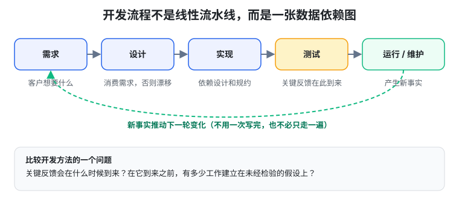
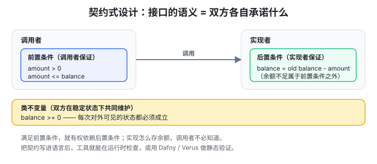

# 生成式软件工程 05 · 软件工程的来龙去脉

> 一句话：前两讲讲"怎么保存和演化软件"，这一讲往回退一步问"**第一份软件从哪来**"。答案是：软件工程这一整套历史包袱（需求分析、流程、契约、建模语言），都是在回答同一个问题——从一句模糊的需求到能用的系统，中间有巨大的 gap；当 AI 把写代码的成本打下来，**哪些困难消失了，哪些只是换了个位置。**

## 开场：AI 先补全了什么

前两讲把软件看作 intent（意图）→ spec（规约）→ impl（实现）的组合体，再用版本管理保存它们的演化。这一讲回到更早的问题：从一个空项目、一句模糊的需求出发，怎样得到一个真正能用的系统？

今天的答案很自然：**先让 AI 做出来看看**。课堂上 Office Assistant 就是 GLM-5.3 直接生成的原型。以前要花很多时间补齐的细节——界面怎么组织、数据怎么存、失败怎么反馈——现在模型几秒就能补完。但"第一次演示很顺利"只能说明这些决定在**演示场景**下能组成一个可运行系统，是否符合用户真正需要，还要继续检验。

关键背景：在大模型出现以前，补齐这些细节需要**昂贵的人力**。接到任务就让所有程序员开写，往往让不同人沿着不同理解前进，等代码拼起来才发现"同一个需求"在每个人脑子里根本不是一回事。**这正是软件工程要面对的问题。**

## 不断移动的能力边界：别把今天的短板当永恒

这一讲花了不少篇幅讲"能力边界一直在动"，核心是别把"AI 现在做不好的"误当成"人类永远的优势"：

- **Jev / System I**：课堂讨论的 Jev 演示让人联想到人类的 System I——不先在脑中写完分析，就对眼前的事快速反应。TypeSafe AI 强调"一次查询并行输出结构化结果"。"是不是 prefill only 的 Transformer"只是实现猜测，真正的问题是：实时决策是否一定要经过逐字生成。
- **Noam Brown 谈 taste**：taste 是"对接下来该做什么的直觉"——面对很多方向，哪个问题值得问、哪个实验值得做。AI 能干完一个人 90% 的工作后，人自然转向剩下的 10%，但这 10% **不因此成为人的永久领地**。他预测再过一两代模型，模型连这种判断也会超过自己。
- **反馈能不能拿到**：写程序能跑测试、数学证明能查推导；选方向、澄清需求、管长期记忆更难评价。但"难评价"未必永远无法训练——方向靠后续实验检验，需求靠交付是否合意评价。反馈更晚、更贵、更有噪声，都是工程问题。
- **The Bitter Lesson（Richard Sutton）**：能吃更多算力的通用方法，最终会超过手写领域知识的方法。课堂顺势提出"**数据分布工程**"：训练关键不只是收集多少数据，还包括在什么阶段、以什么比例/难度/顺序接触哪些经验，再按学习进展和泛化表现不断调整。
- **递归自我改进（RSI）**：发现领域 → 建立反馈 → 获得新能力 → 用新能力改进下一轮训练。这个循环能不能转起来，要看每轮是否带来**经过独立验证的净收益**——模型给自己打高分不等于真的变强。

## 软件危机从哪里来：1960 年代的起点

回到 1960 年代：编程工具不成熟、写程序要大量专门知识、程序员很贵（硬件往往更贵）。而且"会编程"不等于"懂客户业务"，客户也未必知道计算机能做什么。软件企业的任务就是**把客户的意图翻译成能工作的系统**——intent 与 spec/impl 的 gap 从一开始就在。

软件需求的**定制性**让问题更尖锐。同样叫"选课系统"：有的先到先得、有的抽签、有的给本专业预留名额；先修课不满足能否例外、谁批准；有人退课名额给候补还是重新抢。这些差别对应的是学校的制度和责任分配——"做一个选课功能"远没有把需求说完。

1968 年《Boys' Life》已经描绘"明日学校"（计算机评分、按自己节奏学习），今天读来依然熟悉。但"因材施教"到系统实现之间还有一堆决定：怎样才算掌握知识？答对一次算不算？教育愿望不会自动变成清晰的程序规格。

人们想做的越来越多，进度/成本/质量/维护越来越难控，这就是"**软件危机**"。更快的机器没有消除危机，反而让人开始尝试更大更难的系统。两个历史锚点：

- **Dijkstra**：1972 图灵奖演讲《The Humble Programmer》回忆，1957 年结婚登记时"程序员"还不是合法职业，他填了"理论物理学家"。《Go To Statement Considered Harmful》里关于程序员水平与 `goto` 数量的尖刻评论，本质不是语言风格之争：**人的推理能力有限，程序结构应该帮助我们理解执行过程。**
- **1968 NATO 软件工程会议**：把工程的理论基础和纪律带进软件生产。"软件工程"这个名字本身带着挑战——能否像其他复杂工程一样**有组织、有依据**地开发和维护软件，而不是只靠少数高手。

## 在约束下，让系统继续工作：阿波罗的启示

Margaret Hamilton 的阿波罗软件是理解软件工程的好入口。登月软件的要求不只是"算法算得对"，还有**有限存储、严格时限、意外发生时系统还能做什么**。

阿波罗 11 号登月时的 1201/1202 程序警报：资源不足后系统重新初始化并恢复关键任务，让发动机控制继续工作。这套恢复机制事先经过大量测试，地面人员因此能判断"可以继续任务"。

这件事把"正确"的含义推进了一步：**只考虑正常路径，程序可能很漂亮；把资源限制、异常、恢复和人的操作一起考虑，才是在构造能交付的系统。**

于是有了软件工程的研究对象：**在成本、时间等约束下，怎样把人的意图变成可以工作、运行和维护的软件系统**——覆盖团队组织、需求沟通、设计、测试，也覆盖代码风格这种看似细小的约定（IEEE 定义强调系统化、纪律性、可量化）。

## Royce 真正在担心什么：瀑布模型被读反了

Winston Royce 1970 年发表《Managing the Development of Large Software Systems》，核心问题是：怎样按时、不超预算地交付大型软件？

文章画出了后来和"瀑布模型"绑定的阶段图（需求→设计→编码→测试→运行）。但**只记住这张图就恰好读反了文章**：Royce 随后指出，照这样简单地推进风险很大，会招致失败。

他的锋利观察：**运行时间、存储占用、I/O 等约束，常常到测试阶段才第一次被真正"经历"，此前只是被"分析"**——而复杂系统的分析并不总能准确预测运行时会发生什么。比如一个控制算法数学上完全正确，却无法在控制周期内算完；删几条指令没用，得换算法、重划任务、甚至重谈系统承诺的功能。问题从测试一路回到设计和需求，此前围绕旧假设的大量工作全部重做。

Royce 的建议之一是 "**do it twice**"：正式交付前先做一个 pilot model（试验性系统），尽早接触最危险的不确定性，让实际运行给设计反馈。用今天的语言，这和 MVP 有共同之处（先花有限代价拿证据），但关注点不同：**MVP 常用来检验用户需求/产品假设，Royce 的 pilot 尤其关心大型系统的技术和运行风险**；敏捷开发则把短周期实现-反馈-调整反复进行，让学习不只发生在一次预演里。

## 把开发流程看成数据依赖：一个更聪明的读法

课堂给了另一个读阶段图的方法：**把它看成一张数据依赖图**，而不是线性流水线。

- 设计消费需求里的信息，否则会漂移；
- 实现依赖设计和规约，否则各模块各说各话；
- 运行测试需要真实实现，判断结果对不对又要需求/规约；
- 交付后的使用和维护不断产生新事实，推动下一轮变化。



这些依赖真实存在，但**没有规定所有需求必须一次写完、所有设计必须一次完成、每个阶段只能走一遍**。我们完全可以只选一小部分需求，走完设计-实现-验证，再按反馈扩展。

TDD（测试驱动开发）顺势点出两种工作的区别：**写期望行为**（可发生在实现之前）vs **执行程序检查行为**（需要实现）。先写测试用例，往往就是在澄清需求：空输入返回什么、余额不足发生什么、重复提交算几次？

于是比较开发方法时，一个有用的问题是：**关键反馈会在什么时候到来？在它到来之前，有多少工作建立在未经检验的假设上？** 原型、MVP、短周期迭代都能从这个角度理解——它们调整工作顺序，控制错误假设的影响范围。

这也解释了**为什么要重读经典**：教材是知识的"有损压缩"，如果只留下 Royce 的阶段图、丢掉紧随其后的批评，得到的知识可能与原文相反。AI 降低了查原文、恢复背景、沿引用查证的成本，让我们能自己建立知识网络再按需压缩。

## 方法和工具怎样减少返工

软件工程为不同阶段发明了不同表达工具：

- 需求文档、用例、界面原型 → 讨论"到底想要什么"；
- 实体关系、状态迁移、模块接口 → 讨论"系统怎么组织"；
- 编程语言 → 把决定落实为可执行行为。

这些方法常**迫使我们回答容易遗漏的问题**。商店说"学生有优惠，满额也有优惠"，列成决策表就逼你决定：学生折扣能否与满减叠加？门槛按原价还是折后价算？

- **QuickCheck / 性质测试**：先表达"一类输入都应满足的要求"，再生成输入找反例。排序的例子很经典——"输出有序"不够（永远返回空列表也满足），还要"输出保留输入各元素及其出现次数"。**写性质的过程，就是在发现自己究竟想让程序做什么。**
- **需求可追踪性**：需求、设计、实现、测试之间是否还保持联系。退课规则改成"仅开学第一周允许"，得知道哪些界面/权限检查/状态迁移/测试受影响。

这些工具的共同作用：**让决定更明确、矛盾更早暴露、后续工作有据可依。** 下一节追问：能否为这些依据设计一种更准确、也更容易机器检查的语言？

## 契约：调用者与实现者各自承诺什么

Bertrand Meyer 的"Design by Contract"出发点很朴素：一个组件调用另一个组件时，双方应明确各自的责任。

- **前置条件**：调用者要保证什么；
- **后置条件**：前置成立时，实现者要保证什么；
- **类不变量**：对象在对外可用的稳定状态下应满足的条件。

三者一起构成接口的**语义**，而不只是参数和返回值的类型。一个不允许透支的账户（Eiffel 风格）：

```eiffel
withdraw (amount: INTEGER)
    require
        positive_amount: amount > 0
        sufficient_balance: amount <= balance
    do
        balance := balance - amount
    ensure
        balance_decreased: balance = old balance - amount
    end
```



两个关键点：

1. **`old balance` 表示调用开始时的余额**；类不变量 `balance >= 0` 每次对外可见都成立。实现怎么存余额，调用者不必知道；只要满足前置，就有权依赖后置。
2. **契约明确划出边界**：余额不足的请求不满足前置条件。但如果产品要求把"余额不足"当正常业务结果返回，就应另写契约（失败状态 + 余额不变），不能一边接受任意取款、一边用"调用者不该这样调"逃避业务要求。

把条件写进语言后，工具能**运行时检查**某次调用是否违约，也能在合适语言/逻辑系统里做**静态验证**（Dafny、Verus 延续了这个方向）。一次断言通过 = 这次执行没触发违例；一个验证结论 = 取决于写下的规约、假设和工具支持的推理——**都需要先把真正关心的性质表达出来。**

## 重新阅读 UML：五个设计问题

UML（统一建模语言）试图为面向对象系统提供共同的模型元素、记号和语义，让需求/设计在还没变成代码时也能较准确地交流。自然语言能调动经验却容易各人各解，数学语言靠共同定义对齐，UML 也在做某种语义对齐。

很多人学 UML 的印象是"记图形箭头，考试后忘掉"。课堂建议带着一个贯穿全篇的问题重读规范：**哪些意图必须明确固定下来，哪些选择可以留白？** 因为真正的开发要与别人协作、也要与下个月的自己协作；一个有用的模型会逼出你没意识到的问题（连续点两次"支付"算一次授权还是两次）。

沿着 UML 2.5.1 规范，有五个设计问题（**不必先决定 UML 还流不流行，创造它时面对的问题今天仍然成立**）：

1. **图 vs 模型**：模型包含元素/关系/约束，图只是对一部分内容的展示。同一模型可有不同视图；图没画多重性，不等于模型没有。规范本身把语义落成机器可读的 XMI（正文与 XMI 冲突时以后者为准）。推广到自己的项目：**凡要跨工具、跨时间保留的意图，都要找到显式数据表示**，否则需求文档改了、设计图没改、测试坚持第三种解释，语义就逐渐分裂。
2. **契约 vs 实现**：一次成功处理不等于每次都应成立。UML 用前置/后置/不变量/协议状态机/多重性表达要求——"查询支付状态"不该顺手改状态，协议状态机描述某操作在什么状态才允许发生。继承也一样（子类 `isSubstitutable` 声称可替代父类，写下声明 ≠ 工具已证明）。自然语言能写"任何重试都不能重复扣款"，但不会自动检查实现是否遵守。
3. **留白也是一种决定**：语言不需要使用者第一天就穷尽细节。UML 交互语义区分合法/非法执行轨迹，两者不一定覆盖所有轨迹——存在"尚未表态"的行为。支付例子：合法（确认→扣款→成功）、非法（没确认就扣款）、**尚未规定（超时后是否自动重试）**。第三类不能当成已获业务认可；实现者若选自动重试，就得继续回答"超时是否可能已扣款、怎样不重复扣款"。
4. **不同的含义用不同的表达**：一个记号别承担多种没说清的含义。属性值相同 ≠ 同一个对象；聚合、可导航性、关联端所有权各有各的记号（规范还废弃了把"可导航"当所有权的旧约定）。交互图上下位置 ≠ 全局串行（`seq` 是弱顺序，不同生命线的事件仍可交错）——短信画在备货上方，不自动要求短信发完仓库才开工。
5. **模型本身也要检查**：OCL（对象约束语言）表达结构规则，像查程序类型一样查模型；元模型规定"模型由什么组成"；Profile 扩展要有边界。但**良构性检查只说明符合建模规则，不证明实现符合业务需要**——语法正确的支付模型仍可能遗漏重复扣款。规范里有些约束明确标注"Cannot be expressed in OCL"，所以不能宣称所有语义都已机械判定。

## LLM 时代：差距移到了哪里

UML 想让意图通过共同语言变成明确结构和约束；LLM 让"自然语言直接生成程序"这条路可行，以前要人工补齐的中间步骤现在可以一跃而过。

**但规约与实现之间的差距仍然存在。** 当用户没说"支付超时怎么办"，模型为了完成程序会自己选一种：第一次等待、第二次自动重试、第三次直接失败——三份代码都能跑、接口相同、正常路径测试全过，却包含了不同的业务决定。

所以需要有人持续维护**三类信息**：

- **已决定的行为**（扣款前必须获得确认）；
- **明确禁止的行为**（累计扣款不超过应付金额，重试/并发回调纳入约束）；
- **尚未决定的行为**（内部用什么存储、怎么组织请求——留出实现自由）。

承诺可以先写自然语言，再按代价和工具能力落实为接口契约、状态机、断言、测试或验证条件；它们要能**独立于某次聊天和某份实现被保存、检查，并在需求变化时一起更新**。版本管理保存决定的历史，可追踪关系把决定与实现及证据连起来。

> 结论：**AI 越能快速生产代码，接口越值得认真设计**——哪些事已决定、哪些行为绝不能发生、哪些细节交给实现者选。给已决定的事一个显式、类型化、机器可检查的表达，才能在快速改写实现时继续保有对软件行为的控制。

## 总结：本讲真正要记住的

1. **软件工程的起点是 intent→spec→impl 的 gap**，从 1960 年代软件危机就存在；AI 补全的是 spec/impl 的翻译，但没消除这个 gap。
2. **能力边界一直在动**：taste、需求澄清、长期记忆今天难评价，但"难评价 ≠ 永远无法训练"（数据分布工程、RSI 是开放方向）。
3. **瀑布模型被读反了**：Royce 真正担心的是"约束到测试阶段才第一次被经历"，所以建议 do it twice / pilot。
4. **把开发流程看成数据依赖图**，而不是线性流水线；关键问题是"关键反馈何时到来、之前有多少工作建立在未经检验的假设上"。
5. **契约式设计**：前置/后置/不变量构成接口语义，让工具能检查、能验证。
6. **UML 的五个设计问题**（图vs模型、契约vs实现、留白、分开维度、模型可检查）在 LLM 时代依然成立。
7. **代码便宜以后，真正的杠杆是需求、产品、架构**——尤其是维护"已决定 / 禁止 / 未决定"这三类信息，并给已决定的事一个机器可检查的表达。
