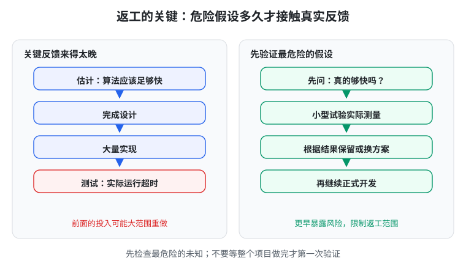
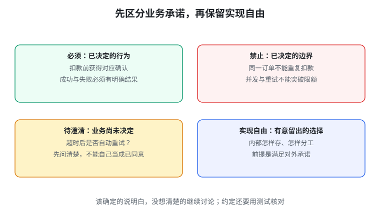

# 生成式软件工程 05 · 软件工程的来龙去脉

> 先记一句话：**软件工程的方法，是为了让大家少猜一点，让错误早一点被发现，让系统遇到变化还能继续工作。**

这一篇不要求背历史人物和年份。重点是理解：为什么“大家开始写代码”还不足以完成一个项目？

## 1. 软件危机：想做的越来越大，交付却越来越难

一个人写十行小程序，主要考虑语法和计算。几十个人做教务系统，还要理解学校规则、分工、接口、进度和错误恢复。

同样说“选课”，可能有不同意思：先到先得、抽签、本专业优先、老师特批。程序员都认真工作，也可能各自实现了不同理解。

20 世纪 60 年代，软件越来越大，延期、超预算、难维护等问题变得突出，常被称为**软件危机**。1968 年的 NATO 会议推动了“软件工程”这一领域的讨论。

它想回答的是：**能不能用有组织、能检查的方法开发软件，而不只靠个别高手临场发挥？**

## 2. 正确不只是正常输入时算对

宿舍记账工具正常运行，不代表所有情况下都可靠：

- 人数填成 0，怎么办？
- 提交一半断网，账单保存了吗？
- 点两次按钮，会不会记两笔？
- 计算太慢，使用者以为没反应又点一次，怎么办？

**异常**就是偏离正常流程的情况；**恢复**就是异常后怎样回到可继续工作的状态。

阿波罗软件在资源紧张时仍要恢复关键任务，是一个历史例子。这里值得学的不是“多写几个判断”，而是：**资源限制、失败和人的操作，也属于系统要求。**

## 3. 需求、设计、实现、测试分别做什么

把这些词放到记账工具里就容易懂了：

| 步骤 | 问题 | 例子 |
| --- | --- | --- |
| 需求 | 使用者需要什么？ | 没参与聚餐的人不分摊 |
| 设计 | 各部分怎样组织？ | 输入、计算、保存分开 |
| 实现 | 用代码怎样完成？ | 写出分摊函数和页面 |
| 测试 | 怎样检查符合要求？ | 给不同参与名单，核对金额 |

这些步骤有联系，但不是“所有需求一次写完，再永不回头地推进”。做出一小部分后，真实使用可能反过来帮你发现需求。

## 4. 瀑布模型的问题：反馈可能来得太晚

**瀑布模型**常被画成需求 → 设计 → 编码 → 测试 → 运行。

如果到最后才第一次实际运行，发现速度根本达不到要求，可能不是改一行代码就能修好，而是算法和设计都得重做。

Royce 的相关经典文章并非简单赞美这种单向流程，而是指出风险，建议先做试验性系统。

**Pilot，试验性系统**，就是先拿一个小版本碰最危险的未知。例如先测“这个算法在真实机器上是否足够快”。

上一篇的 MVP 更常用于验证“用户是否需要”；pilot 更偏“技术是否行得通”。两者都在让关键证据早点到来。

## 5. 测试可以帮助你想清楚要求

写代码之前，先写“什么输入应该得到什么结果”，会逼你回答含糊问题。

例如“给列表排序”：

- 输出应该从小到大；
- 原来的元素不能丢，也不能凭空多出来。

只检查第一条，永远返回空列表也可能过关。

**性质测试**就是检查一类输入都应满足的规律，常配合自动生成许多输入。**TDD，测试驱动开发**，大致是先写一个会失败的测试，再补实现，再整理代码。

它们不是保证永远无错的魔法。价值在于把“我觉得应该这样”变成明确检查。

## 6. 契约：函数也可以有双方约定

借书时，你保证按规则借还，图书馆保证提供对应服务。函数之间也可以有约定，这叫**契约式设计（Design by Contract）**。

一个取款操作可以约定：

- **前置条件**：调用前，金额为正且不超过余额。
- **后置条件**：调用成功后，新余额等于旧余额减金额。
- **不变量**：这个不允许透支的账户，在正常可用状态下余额不能为负。

接口不只是“参数是什么、返回什么”，还包括这些行为承诺。**接口**可以理解成一个部件提供给其他部件使用的入口与约定。

不过现实用户余额不足时，不该只得到程序崩溃。若产品要求“返回余额不足提示”，就要把失败结果也写进约定，不能用前置条件逃避需求。

**断言**是程序中的条件检查，运行时发现不满足就报告问题；**静态验证**是在不运行所有输入的情况下，用工具推理某些性质。两者都只能检查你真正表达出来的条件。

## 7. UML：先把关系与流程画清楚

**UML，统一建模语言**，是一套描述系统结构与行为的共同图形规则。入门不用先背各种箭头，先看它在帮你问什么问题。

### 图不等于全部信息

选课图画了学生连到课程，还没说明每人能选多少门。一张图可以省略细节，但不能靠省略替业务作决定。

**模型**是你整理出的对象、联系和规则；图只是展示它的一种方式。

### 演示成功不等于作出普遍承诺

某次支付成功，只说明这次成功。若要求“重复点击不重复扣款”，就要专门表达和检查这条规则。

### 没说的地方，不要当成已获许可

支付超时后要不要自动重试？这是待澄清的业务问题。AI 自己选了“重试”，不等于用户已经同意。

### 不同问题要分别回答

“能从学生找到课程”不等于“删除学生就删除课程”。访问关系与生命周期是不同问题。

画在上方的动作，也不一定表示所有人都要等它完成。确实需要先后顺序时，就明确说明。

### 模型也可能写错

图看起来规范，仍可能漏掉重复扣款。检查图形规则和检查业务正确，是两件事。

## 8. 先分四类，AI 才知道哪些能自己选

给 AI 写需求时，试着分开：

| 类别 | 例子 | 怎么处理 |
| --- | --- | --- |
| 必须 | 扣款前用户确认 | 写成承诺并检查 |
| 禁止 | 同一订单重复扣款 | 写成限制并检查 |
| 待澄清 | 超时后是否重试 | 先讨论，不偷偷默认 |
| 实现自由 | 内部怎样组织数据 | 满足承诺即可选择 |

这比“全部细节都写死”更合理：该明确的要明确，不影响用户承诺的部分可以留给实现者。

## 9. AI 变强了，这些方法为什么还有用

代码更容易生成，错误要求也更容易被迅速扩散。

AI 可以帮你列边界情况、写测试、画流程图；你再用真实业务和独立证据检查。这些方法提供的是共同判断依据，而不只是多一份文档。

模型能力会变化，不必把“今天不会”当成永远不会。现在先掌握这些方法，能让你更好地提出问题和验收结果。

## 动手试一次

为记账工具增加“删除错误账单”：

1. 写清谁能删除、删错能否恢复。
2. 列一条必须行为、一条禁止行为、一项待澄清问题。
3. 写正常和失败的测试。
4. 如果最担心“删后金额算错”，先做这个小实验，再扩展界面。

## 本篇记住这四点

1. 软件工程解决的是共同理解、组织和验证，不只是编码。
2. 关键反馈要早点来，别把大量工作押在未经检验的假设上。
3. 契约明确调用前后和持续应满足的规则。
4. 模型帮助表达问题；清楚的图也不能替代正确的业务决定。

继续阅读：[06 · 需求和架构（1）](#/item/knowledge:courses/gse-2026-nju/06-requirements-architecture-1)。

## 资料来源

依据[第 5 讲官方讲义](https://jyywiki.cn/GSE/2026/lect5.md)整理，核对日期：2026-10-01。延伸材料：[契约式设计](https://www.eiffel.com/values/design-by-contract/introduction/)、[UML 规范](https://www.omg.org/spec/UML/2.5.1)。例子、图解与练习为学习整理；原课程材料权利归作者，课程网站标注 CC BY-NC 4.0。
