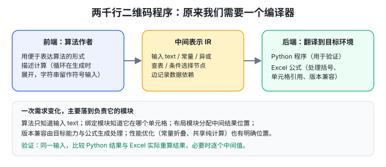
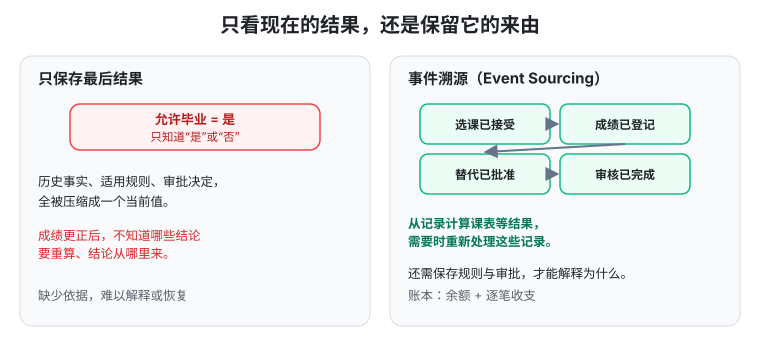

# 生成式软件工程 06 · 需求和架构（1）

> 一句话：当生成代码变得便宜，"**要做什么**"和"**怎样组织系统才能承受下一次变化**"成了真正的杠杆。这一讲用三个规模递增的例子——十行汉诺塔、两千行二维码程序、几十万行教务系统——讲同一件事：**选择表示方式**，并由此引出事件溯源、CQRS 和 DDD。

## 代码便宜以后，什么变得更重要

传统软件工程面对几个朴素而顽固的事实：

- 客户用自然语言描述工作，开发者却必须翻译成精确行为；
- 满足同一组要求的实现有很多，各有优劣；
- 产品好不好用，往往要做出来才知道；
- 代码生产和返工都很贵，一个前面的误解可能变成后面整个团队数周的无效劳动——"软件不软"，改起来一点也不轻松。

但需求、产品和架构又特别**难做定量研究**：一个架构今天顺手、三年后还合适吗？产品成功了，是方法有效还是参与者本来就更有经验？课堂调侃"学校里的软工人都不在做软工"——容易量化的研究对象，未必是软件生产中最关键的困难；能预测一些缺陷，不等于知道客户要什么、产品该长什么样。

所以结论很直接：**当生产目标明确的代码变便宜，需求、产品设计和架构就成为撬动生产力的杠杆。** 一个正确的抽象能让后续大量代码都容易生成和检查；一个含混的决定也会被 AI 迅速扩散到整个系统。只追求生成速度，最后得到的就是 AI Slop——代码和功能不断堆积，却越来越难说明它们为什么正确、彼此怎样配合。

## 教务系统为什么会陷入需求泥潭

需求工程在学校里难讲：学生不会去见真客户，作业也很少大到要处理需求冲突。现在做出可用的原型容易多了，人人都有机会体验一次产品经理——身边的教务系统就是好起点。

教务系统表面是几张表、几个页面，背后连着许多参与者：学生（学籍、选课、考试、成绩认定、毕业审核）、教师（开课、管名单、登记成绩）、教务员（排课、处理学籍变化和申请）、教务处（执行政策、汇总统计）、财务和辅导员各有业务。

经典做法是把需求方逐一访谈，但可能期末考试都结束了。更麻烦的是：**客户常常说不清楚完整需求**——一个人熟悉日常普通情况，未必能立刻列出所有例外；不同人即使都说清楚了，也未必达成一致。学生想选上课、教师想控制班额、教务员想学生按时毕业，遇到同一门满员的必修课，就需要有人做业务决定。

### 一个虚拟培养方案：复杂性在于规则会相遇

构造一个转专业学生的培养方案，感受一下：2024 级学生 2026 年转入计算机专业，适用目标专业 2024 版方案：

- 毕业至少 160 学分（通识 40 / 专业必修 72 / 专业选修 28 / 实践 20，每类分别达标）；
- 数学：5 学分高数 A，**或** 4 学分高数 B + 1 学分桥接课；
- 算法课要先通过数据结构；缓考学生可暂时选课，开课前仍未通过则撤销；
- 两门交换课程经批准可合抵一门 4 学分算法课，但同一份学分不能再计入专业选修；
- 重修只计一次学分，成绩单保留历次记录，绩点按方案规定取较高成绩。

每一条单独看都不难，**真正的困难在于它们会相遇**：转专业学生恰好参加过交换、交换课程还没认定、先修课正等缓考成绩、选课窗口却马上关闭。更现实的是，总有某种线下批准的特殊情况没来得及变成系统规则，最后只能留一个"视为满足"的兜底入口——就是大家调侃的"暗箱操作"。这个入口本身也有需求：谁有权批准、豁免哪一项、适用于哪个学生哪一版方案、理由是什么。

课堂有个很有冲击力的经历：第一天绕过前端校验，把一位同学的缺课次数改成 `-1`，结果教务系统里**所有能选出这位同学选课记录的部分都瘫痪了**。没定位到具体某行 bug，但能看到：某个看似局部的数据假设已经被许多功能共同依赖，一个特殊值进入系统，问题就沿依赖扩散。

> 功能勉强做全、例外靠补丁维持、改一处牵动多处，软件就逐渐进入"焦油坑"。

## MVP 帮助发现需求，也会掩盖困难

AI 让 MVP 变得非常容易。先实现最重要的功能，把可操作的产品交给用户，往往比继续讨论抽象需求有用——看到课表、选课按钮、毕业审核结果，用户马上能指出"这门课我交换时修过了，为什么还要再修"。试用本身就在帮我们发现没说出口的需求。

但第一次顺利运行也容易让人产生"我已经驾驭了 AI"的错觉：原型走通了正常路径，转专业、课程替代、规则追溯、人工批准的角落还没露獠牙。更大的考验是**需求变了以后怎么办**。

例如把"一门交换课程替代一门本校课程"改成"允许两门交换课程合抵一门必修课"，受影响的就不只是一个下拉框：课程对应关系、学分计算、毕业审核、成绩单显示、相关测试全要变；已认定过的学分是否重算、已批准的特例是否继续有效，也要给答案。

上一讲的数据依赖图再次出现：**一个结论以另一个结论为前提，需求变化就沿依赖穿透整个系统**；软件增长越快，未管理的依赖积累越快。"没有银弹"里的银弹借指西方传说中杀死狼人的武器，形容人们期待的一招制胜——快速生成原型很有价值，但需求冲突、历史包袱、持续变化仍要有人处理。接下来的问题就是：**怎样让这些复杂性有合适的位置？**

## 几行代码也有架构

软件架构决定我们怎样分解问题、安排职责、组织依赖。它让一些事变容易，也决定另一些事将来要付多少修改成本。一个系统的品味、能走多远，很大程度上取决于这些选择。

不必等到有数据库、微服务、流式处理才谈架构。一个小程序也可以先"读取输入 → 解析 → 处理 → 输出"，这几个阶段一旦成为明确边界，就有机会分别考虑：换输入格式改哪里？核心算法是否必须知道结果写到终端还是文件？错误由谁处理？

当然，切成四个函数还不保证边界真的存在——如果它们随意改同一批全局变量，每一步都依赖其他步骤的内部细节，变化仍会四处传播。**架构的价值要落实到数据怎样流动、谁拥有状态、谁可以依赖谁。**

所以学编程语言时，每种构件都可能与架构有关：函数帮助表达边界，类型帮助约束表示，作用域限制信息可见范围，调用栈保存未完成的工作。只以"语言律师"方式记语法细节，会错过更有意思的问题：这些机制怎样帮我们掌控一个程序？

## 十行汉诺塔背后的三种看法

汉诺塔：把一叠盘子从 A 柱移到 C 柱，借助 B 柱，每次只移最上面一个，大盘不能压小盘。递归解法很自然（先搬上面 n-1 个，再搬最大的，最后搬回那 n-1 个），但一要求"不用递归"，许多人就不知道怎么写了。**三种写法，分别把复杂性放在不同的地方：**

1. **数学规律**：盘子从小到大编号 1..n，最少步数解中第 `step` 步移动的盘号 = `step` 二进制表示末尾连续零的个数 +1（三层汉诺塔步号 1..7 对应盘号 `1,2,1,3,1,2,1`）。每个盘子沿 A→B→C 环的方向也由总盘数和盘号奇偶固定。只记录每个盘子位置，就能写出核心循环：

```c
for (uint64_t step = 1; step <= total; step++) {
    int disk = 1;
    for (uint64_t x = step; (x & 1) == 0; x >>= 1) disk++;
    int direction = (n - disk) % 2 == 0 ? -1 : 1;
    int from = position[disk];
    int to = (from + direction + 3) % 3;
    printf("Move disk %d: %c -> %c\n", disk, pegs[from], pegs[to]);
    position[disk] = to;
}
```

   代码短，是因为**对问题的理解承担了原本要代码处理的复杂性**。代价是必须解释和验证这些规律；游戏规则一变，数学结构未必还能用；短代码也没消除指数级的移动次数。

2. **任务分解 + 栈**：把"还没做完的任务"存起来。任务记录盘数、起点、终点、辅助柱；只有一个盘子直接移，否则拆成三个子任务，按执行顺序的**反方向**压栈（因为后进先出）。得到的是不断"取出-分解-执行"的循环。递归表达的任务结构还在，只是等待执行的工作由我们显式保存——不依赖步号规律，只需把熟悉的递归分解说清楚。

3. **模拟调用栈帧**：直接模拟函数调用的执行过程。每层调用一个栈帧，保存 `n`、三根柱子角色、以及程序计数器 `pc`（这层执行到哪一步）。遇到调用就压新帧，返回就弹帧，轮回上一层时按它的 `pc` 继续执行。**这时我们其实构造了一台很小的抽象机器**：函数调用和返回都变成状态转移，"非递归汉诺塔"成了理解程序执行语义的机会，还能推广到更一般的递归过程。

三种写法分别把复杂性放在**数学规律 / 任务分解 / 执行机器**里。课堂用不同模型给出的代码对照，但价值在这些表示方法本身。只盯着眼前该写哪个 `if`，会陷入越来越多的分支；换一种表示，问题可能突然变简单。**架构关乎的，正是我们对问题掌控到了什么程度。**

## 两千行二维码程序：原来我们需要一个编译器

从汉诺塔向外看：代码之外有客户工作的规律，客户之外有社会运行的规律，还有数学和物理世界的规律。跳出当前代码寻找更合适的解释，是贯穿本讲的方法。

具体需求：在 Excel 输入字符串，由工作表公式计算并显示二维码，修改输入后二维码随之变化。直接让 Agent 写所有公式，很快碰到长公式的脆弱性——括号、引用、数组运算、算法步骤缠在一起，模型大量时间在与不配对的括号搏斗。就算公式能跑，下一次变化仍很痛苦：兼容更老的 Excel、移动二维码位置、换计算方法、加一个输入单元格，原本局部的修改都穿过整片公式。

跳出公式看：二维码算法用普通编程语言不难描述，困难在于**怎样把这些计算映射到工作表**。我们真正需要的其实是一个**小型编译器**：用一种便于表达算法的形式描述计算，再翻译到目标环境。



引入**中间表示 IR（Intermediate Representation）**：保存输入、常量、异或、查表、条件选择等计算节点，节点间的边记录数据依赖。前端负责构造计算图，后端负责翻译成 Python 或 Excel 公式。这里要分清**生成时 vs 运行时**：

- Python 中的循环在生成时按选定容量展开有限步骤；
- 用户将来输入的字符串要**保留为符号输入**；
- 由字符串内容决定的分支，必须变成图里的条件选择节点，留给 Excel 重算时判断——否则生成器只是提前算出一张固定二维码，没实现原需求。

有了 IR，几类变化就各有位置：算法只知道名为 `text` 的输入；输入绑定模块知道它在哪个单元格；布局模块分配中间结果和最终图案位置；版本兼容由目标能力与公式生成处理；加一个输入则先明确它怎样参与拼接/编码/容量计算。IR 也要自己的语义（字节取值范围、整数除法、字符串编码、数组形状不能两个后端各猜各的），构图时检查类型和容量，节点保存来源以便追溯错误，括号和单元格引用由生成器统一处理。

性能优化也有明确位置：与输入无关的内容**生成时算好（常量折叠）**，重复的纯计算**共享一个节点**，真正生成工作表时再决定哪些内联、哪些放辅助单元格（微软 Excel 性能指南也建议减少重复计算、拆解巨型公式）。两个后端还提供了验证办法：相同输入，比较 Python 结果与 Excel 实际重算结果，必要时逐个中间值；但两者可能共享同一算法错误，所以还要独立实现或二维码解码器核验内容。

> 这套设计的价值：**一次需求变化主要落到负责它的模块**；仍需验证整个结果，但不必每次都重新与所有公式搏斗。

## 几十万行教务系统：当前状态里藏着什么

规模继续放大，架构仍是"怎样看待问题"的选择。很自然的办法是把系统理解成**当前状态的快照**：现在有哪些学生、教师、课程、选课记录，每出现一个需求就加一段查询或修改记录的逻辑。这就是 **CRUD（创建/读取/更新/删除）**；数据库范式帮我们减少冗余和更新异常，对简单数据维护很直接。

但教务系统里许多字段已经是**推理和决策的结果**。一个 `can_graduate = true` 可能依赖课程成绩、课程替代审批、培养方案版本、人工豁免——它把**历史事实、适用规则、根据规则作出的决定，压缩成了一个当前值**。

这又是数据依赖：成绩更正后哪些学分认定要重算、哪些毕业审核要复核？已经正式发布的决定还能不能直接覆盖？即使表里没有重复字段，**如果不保存这些依赖，我们仍然不知道一个结论从哪里来，也不知道前面的变化会破坏哪些后续结论**。

更麻烦的是，软件只是现实过程在信息世界中的**有损投影**：现实中政策已更新、领导已批准，系统却还没来得及表达。眼看今天不处理学生就不能毕业，工程师只能先把数据库改成"满足毕业条件"。如果最后只留下一个布尔值，几个月后就没法分辨：这是正常审核、正式特批，还是一次救火误操作？——程序还能跑，数据却逐渐变成无法解释的黑洞。继续让 AI 修修补补，能消除眼前的报错，却未必补回已丢失的业务含义。

## 计算机系变成计算机学院：ID 要不要变

需求的语义本身还会变。课堂提到"南大没系啦"：计算机系变成计算机学院。对师生喜大普奔，对教务系统却立即出现一个问题：`dept_id` 沿用旧的还是新建一个？

- **沿用旧 ID**（直接覆盖名称）：学生、课程、权限的关联继续工作；但查询历史成绩单或报表时，连到现在的组织表，过去的"计算机系"也被显示成"计算机学院"；若层级、职责、管理范围一并变，一个 ID 就混入了不同时间的含义。
- **新建 ID**：旧组织保留了，但新学院可能变成没有学生、课程、权限关联的空壳；把所有旧关联迁过去，又会改写学生和课程过去的归属；跨年统计、权限继承、培养方案适用范围仍要解释两个组织的关系。

关键在于区分**组织身份、组织属性、某个时刻的隶属关系**：若业务认为身份延续，保留稳定 ID、让名称层级按有效期存版本；若认为产生了新组织，建新 ID、记录带日期的承继关系、按业务决定转移关联并保留历史归属。查询也要说清口径：看当时的归属，还是按今天的结构重新汇总？培养方案应有自己的版本，不能因组织改名就让学生自动适用另一套毕业要求。

系统一旦运行，这类修改就很贵：**代码可以重写，历史依据不能凭空补出来**。旧系统里同一个"已毕业"可能来自几种完全不同的过程，迁移时不知道原含义，就很难保证新系统继续正确解释——理解并承接这些积累，正是 ERP 及类似复杂业务系统的部分长期价值。

## 把历史保存下来：事件溯源

既然依赖和历史如此重要，为什么不把它们变成程序能显式表示、保存和处理的对象（first-class citizens）？

数据结构有两种观察角度：可以只保存"张三目前选了《生成式软件工程》"，也可以保存"张三的选课申请已被接受"这件事，以及后来是否退选、是否再选入。**把被系统接受的事件依次应用到初始状态上，就得到当前状态；改变查询方式，还能回答过去发生了什么。** 这就是 **事件溯源（Event Sourcing）**：把状态变化保存在事件序列里，让状态能由记录重建。账本是个好类比——余额告诉我们现在有多少钱，逐笔收支还能解释钱为什么变成了这么多（Martin Fowler 的 Event Sourcing 介绍讨论了历史查询和重放能力）。



回到教务系统：记录"选课已接受、成绩已登记、课程替代已批准、毕业审核已完成"等事件，再从中构造学生课表、教师点名册或审核视图。把事件转换成某种状态/查询结果叫**投影**；重新应用已有事件叫**重放（replay）**。

记录历史不要求每次查询都从入学重算：日常维护当前结果、新事件到来时增量更新；需要重建时再重放相应历史，或从有明确位置的快照继续处理。不过，**事件序列只告诉我们发生了哪些变化**；要沿依赖找到受影响的结论，还应记录一次学分认定/毕业审核具体用了哪些输入、哪个规则版本、什么审批依据——把日志保存下来是为可解释性备料，还需要设计这些材料之间的关系。

## 恢复历史 vs 按新规则重算

保存事件让我们在语义改变时有更多余地，但不能理解成"规则随便改、历史自然都正确恢复"。至少要区分两个问题：

1. **当时究竟发生了什么、为什么作出那个决定？** → 需要当时记录的事实、适用规则和有关输入。
2. **用今天的新方案重新审核会得到什么？** → 靠新的投影/计算，但它**不自动改写已经发生的事实**。

例如学生已获学位，今天换规则重算不满足要求，不能因此让"当年已授予学位"从历史消失；若业务上要复核或撤销，应走相应流程再记录新决定。事件格式和业务规则也会各自演化，要分别管版本；事实录错时追加更正事件及原因，保留原始记录与更正的关系（微软事件溯源说明讨论了事件版本、补偿事件和历史格式演进的成本）。

重放还要**隔离对外部世界的副作用**：重建一次选课视图，不能再给所有学生发一遍短信、更不能重复扣费；若历史决定依赖一个外部查询结果，也要保留当时的输入，不能拿今天查到的值冒充过去的依据（Fowler 的 External Updates 一节处理的就是这类问题）。历史保存越完整，越能解释旧决定、比较新方案、修正错误——**哪些信息值得保存，仍是一项架构决定。**

## CQRS：怎样做决定，怎样看结果

有了这些观察，就更容易理解 LLM 之前的实践。**CQRS（Command Query Responsibility Segregation，命令查询职责分离）**把"负责接受业务操作的写模型"与"负责提供查询结果的读模型"分别设计。

命令表达业务意图（如"申请选课"），写模型检查先修资格、课程容量、时间冲突再接受/拒绝；查询服务于不同使用者（学生看课表、教师看点名册、教务员看开课统计），没必要被迫用同一种展示结构。写模型集中维护业务约束，读模型为查询准备专门结构、适当冗余或预计算。**CQRS 的重点是两类模型的职责**，可以在同一进程、同一数据库实现；是否再采用事件溯源是另一个选择（微软 CQRS 说明）。

两个要注意的点：

- 若读模型异步更新，可能出现短暂间隙：选课已确认、课表还没刷新。界面要能解释这个状态，系统要明确"选课成功"由哪个环节确认，不能因视图没显示就让用户误以为失败而重复提交。
- 更硬的约束：**只剩最后一个名额，两位学生同时申请，不能让两人都占位成功**。检查容量与确认占位要作为一个不可被穿插的操作完成。用事件存储也一样需要并发控制（追加前检查读到的事件流版本，变了就重读再判断）——并发处理不会因为数据采用追加方式就自动消失。

由此，"哪些部分必须立即一致、哪些查询结果允许稍后更新"就成了可以明确讨论的决定。

## DDD：让业务概念决定边界

**DDD（Domain-Driven Design，领域驱动设计）**的"领域"就是软件试图处理的业务世界。开发者与业务人员共同建立模型，让"选课""学分认定""毕业审批"这些概念进入软件的结构和语言，而不是只围绕数据库表名讨论系统。

在一个明确边界内，同一个词应有一致含义（**统一语言**）；但庞大系统不必强迫所有人共享一份无所不包的模型。DDD 用**限界上下文（Bounded Context）**明确模型适用范围，再描述不同范围如何协作（Eric Evans 的 DDD Reference）。

例如：选课业务关心学生有没有资格、课程有没有名额；财务业务关心应收和到账；毕业审核关心认定学分与适用方案。它们都谈"学生"，但维护的状态和规则并不相同。边界之间传信息也要明确含义："课程成绩已通过"可以成为学分认定的输入，但能否计入某个专业的毕业学分应由学分认定的规则决定——若把两个概念压成同一个 `passed` 字段，以后就很难解释"通过了这门课却仍不满足这项毕业要求"。

> DDD 安排业务语义和模型边界，CQRS 分开接受操作与提供查询的职责，事件溯源提供保存和重建历史的方式——三者可组合，也可按具体问题分别采用。

## 让下一次需求变化有地方可去

把这些想法落实到教务系统，可以先从一个结论开始：一次毕业审核除了保存"通过/不通过"，还记录**输入记录的标识与版本（或当时快照）、规则版本、结论和审批依据**。成绩被更正时，系统就能沿依赖找到受影响的审核；已发布的正式决定进入复核流程。

**时间也值得显式表示**：一项豁免 6 月 1 日生效、6 月 3 日才录入系统，那"6 月 2 日豁免是否有效"和"6 月 2 日系统为什么拒绝毕业"是两个问题。只存一个时间可能无法同时解释——**业务发生/生效的时间，与系统得知这件事的时间，要分别保存。**

**模块边界应围绕可能变化的决定安排**：培养方案、课程替代、组织身份映射各有负责模块和明确接口。起初完全可以把这些模块放一个程序里，先把数据归属和调用关系理清；需要独立发布或扩容时再拆服务——**把一个大文件拆成许多服务，不会自动补上原来没说清楚的业务边界。**

对已运行系统，可以从一条业务链逐步改进：先整理毕业审核的事实来源、规则版本、审批流程，让新旧审核并行计算，重点解释转专业、补考、课程替代、人工豁免案例里的差异，再逐步切换权威写入入口；旧系统提供切换时的基线快照并明确时间和来源；**已经丢失的历史不能伪装成我们亲眼记录过的事件。**

追溯与重算有成本，优先用于确实需要解释依据的业务；简单信息维护仍可 CRUD。每增加一层结构，都应能说明它让哪一种变化更容易处理，以及带来什么新的维护责任。

> 从十行汉诺塔、两千行二维码到几十万行教务系统，规模不同，**选择表示方式的影响始终存在**。给 AI 加"采用 CQRS"几个字就可能生成完全不同的系统；这几个字背后要理解的，是谁维护业务约束、哪些信息应保留、变化沿什么关系传播。代码越容易生成，越值得在这些少量但影响深远的决定上花时间。

## 总结：本讲真正要记住的

1. **代码便宜以后，需求、产品、架构才是杠杆**；一个正确的抽象让后续代码容易生成和检查，一个含混的决定会被 AI 迅速扩散成 slop。
2. **需求难在规则会相遇**（转专业 + 交换认定 + 缓考 + 选课窗口），例外靠补丁维持、改一处牵动多处就是"焦油坑"；MVP 帮发现需求，也会掩盖困难。
3. **架构 = 选择表示方式**：汉诺塔的三种写法分别把复杂性放在数学规律 / 任务分解 / 执行机器里。
4. **二维码程序本质是一个编译器**：前端 + IR + 后端，把"生成时 vs 运行时"分开，让每类变化落到负责它的模块。
5. **当前状态快照（CRUD）会把历史、规则、决定压缩成一个当前值**（`can_graduate = true`），丢失依赖后就成了无法解释的黑洞。
6. **事件溯源**用事件序列保存变化，投影出当前状态、重放回答历史；但重放要隔离外部副作用。
7. **区分"当时发生了什么"与"按新规则重算"**，恢复历史不能改写已经发生的事实。
8. **CQRS** 分开写模型与读模型；**DDD** 用统一语言和限界上下文让业务概念决定边界。
9. **时间双轨、模块边界围绕变化点、逐步改进旧系统**——让下一次需求变化有地方可去。

继续阅读：[第七讲 · 需求和架构（2）](#/item/knowledge:courses/gse-2026-nju/07-requirements-architecture-2)，从选择表示方式继续走到可扩展的解空间与事实驱动的计算依赖。
