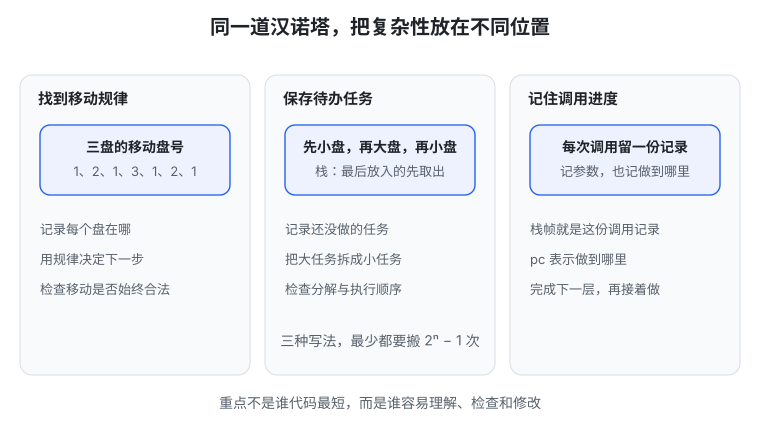
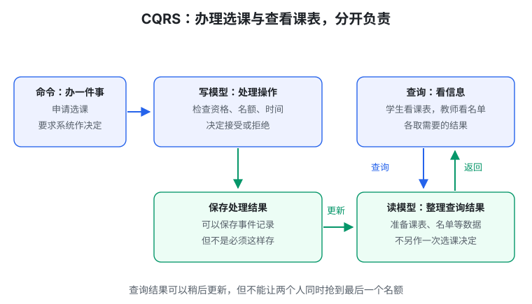

# 生成式软件工程 06 · 需求和架构（1）

> 先记一句话：**架构就是安排“谁负责什么、数据怎样传、变化该改哪里”。不是程序越大、框架越多，架构就越好。**

这一篇名词较多。先跟着例子读：汉诺塔讲怎样看问题，二维码讲怎样分工，教务系统讲怎样保留业务含义。

## 1. 需求为什么难：规则会碰到一起

“做个选课系统”听起来像几个按钮，实际可能遇到：

- 课程已满，但学生必须修它才能毕业；
- 先修课成绩还没出来，选课窗口先关闭了；
- 交换课程已经修过，学校还没完成认定；
- 老师特批了，但系统不知道这项批准。

一条规则单独看不难，几条一起出现，就需要作决定。这里是说明复杂性的例子，不是学校真实政策。

AI 可以很快做出页面，但页面不会替学校决定“这次例外是否允许”。**需求问题不能全部变成代码问题。**

## 2. 架构不是盖楼名词，是给变化安排位置

拿小程序说：

```text
读取输入 → 理解输入 → 计算 → 展示结果
```

如果这几部分分工清楚，改输入格式不必重写算法，换显示页面也不必改计算。

反过来，若每个部分都随意修改同一堆变量，虽然拆成了四个文件，实际上仍然绑在一起。

**模块**就是承担一部分职责的代码单元；**接口**是模块之间约定怎样使用对方。像食堂窗口：你按约定点菜，不必知道厨房每一步怎么做。

好的分工不消灭业务复杂性，但能让你一次只理解一部分。

## 3. 汉诺塔：同一个问题，可以换三种看法

汉诺塔有三根柱子和不同大小的盘子。目标是把盘子从 A 搬到 C，每次搬最上面一个，大盘不能压小盘。

常见的**递归**思路是：要搬 n 个，先搬上面的 n−1 个，再搬最大盘，最后搬回那 n−1 个。递归就是把问题交给规模更小的同类问题。

不用递归，还能怎样做？



### 方法一：找到移动规律

三盘的最少移动序列里，盘号是 `1、2、1、3、1、2、1`，1 号是最小盘。进一步可以找到步号、盘号和方向的规律。

程序记录盘的位置，再按规律移动。代码能短，但你得解释规律为什么正确；规则换了，规律未必还能用。

### 方法二：保存还没做的任务

把“先搬小盘、再搬大盘、最后搬小盘”写成待办事项。

**栈**像一叠盘子，最后放上去的先取出来。若用栈安排任务，就要反着放，才能按希望的顺序执行。

### 方法三：保存每次调用做到哪里

像打电话时记下“谈到第三件事，稍后继续”。程序记录每层调用的参数和进度，完成下一层后再回来。

这份调用记录叫**栈帧**；表示进度的位置常叫 `pc`。先理解“保存做到哪里”，不用先背底层细节。

三种方法都没有减少必须执行的搬盘次数。区别是：**复杂性放在哪里、怎样解释和检查。**

## 4. Excel 二维码：不要到处手写长公式

需求是：输入一段文字，Excel 公式计算二维码；文字改变，二维码也要改变。

直接写大量公式，括号、单元格地址和算法混在一起。换个位置或兼容旧版本，可能牵动整片公式。

更好的办法：**先表达“算什么”，再统一翻译成“在 Excel 里怎样算”。**


这个翻译工具叫**编译器**。你学 C 时，编译器把源代码转换成机器能执行的形式；这里则把计算步骤转换成 Excel 公式。

中间那份统一的计算草稿叫 **IR，中间表示**。它记录输入、固定数值（常量）和计算步骤之间的关系。可以将它翻译成 Python（一种常见编程语言）程序，也可以翻译成 Excel 公式。

好处是分开处理：

- 算法部分：怎么生成二维码；
- 地址部分：输入放在哪个单元格；
- 排版部分：图案放在哪里；
- 翻译部分：目标 Excel 支持哪些公式。

### 提前算好，和以后根据输入算，不是一回事

可以提前准备固定规则和不变表格，但用户将来输入的文字必须留给使用时处理。

如果先算好“你好”的二维码贴进去，输入“再见”后不变，就没有实现需求。

Python 与 Excel 的结果可以比较，但若共用同一个错误算法，也可能一起错。还要用独立扫码工具核对内容；两张二维码长得不同，也未必有一张错误。

## 5. 教务系统：只存最后结果，可能解释不了来由

`can_graduate = true` 可以读成“允许毕业 = 是”。但这个“是”可能来自：课程达标、交换学分认定或正式豁免。

只存一个最终值，后来更正成绩时，你就不知道原决定用了什么依据。

**CRUD** 是创建、读取、更新、删除四类基本数据操作。它适合很多简单管理，但“只留当前值”会丢失来由。CRUD 本身并不禁止保存历史，问题在数据怎样设计。

## 6. 事件溯源：既看余额，也保留每笔收支

银行卡余额是 100 元，你只看余额，不知道这周花过多少钱。保留每笔收支，就能解释余额怎么来的。

**事件**是已经发生、被系统记录的事，例如“选课申请已接受”“成绩已更正”。

**Event Sourcing，事件溯源**，就是主要保存这些变化记录，并用它们计算状态。


- **投影**：从记录计算出某种视图，例如学生课表。
- **重放**：重新处理已有记录，再算出结果。

这不要求每次查询都从入学重算。可以保存算好的结果，新记录来时更新；需要恢复时再重建。

历史本身还不够，重要决定也要保存适用规则、使用了哪些输入、谁批准。

### 重算不能偷偷改掉真实历史

“按新规则计算不满足毕业要求”，不等于“当年授予学位没有发生”。若要撤销，必须有正式流程和新记录。

恢复当时结果要用当时规则与输入，不能拿今天的数据冒充过去依据。重建内部结果，也不能再发一次短信或扣一次费。

## 7. CQRS：办理事务和查看结果，分别设计

在食堂，你向窗口点菜是一种动作，看菜单是另一种动作。系统里也可以把两类职责分开：

- **命令**：要求系统办理一件事，例如申请选课。
- **查询**：询问信息，例如查看课表。

**CQRS，命令查询职责分离**，就是分别设计负责操作的部分和负责查询的部分。



**写模型**负责接受或拒绝操作，守住资格、容量等规则；**读模型**负责提供方便查看的数据。

不一定拆成两套服务器或两套数据库，也不一定使用事件溯源。

若课表稍后才更新，要告诉用户“选课已成功，课表正在更新”。最后一个名额被同时申请时，仍要可靠协调，不能让两个人都成功。

## 8. DDD：按业务分工，不只按数据表分工

**Domain，领域**，就是要处理的业务世界。**DDD，领域驱动设计**，强调和业务人员一起理解概念，再组织程序。

“课程通过”和“这门课能计入毕业学分”不是同一件事。前者可能由成绩部分负责，后者还要看专业方案、重复计分与认定。

**限界上下文**听着抽象，大白话就是“这套概念和规则在哪个范围内适用”。选课、财务、毕业审核都谈学生，但各自关心的信息不同。

三种方法别混：

| 方法 | 主要回答 |
| --- | --- |
| DDD | 哪个业务范围负责哪条规则？ |
| CQRS | 谁办理操作，谁提供查询？ |
| 事件溯源 | 保存哪些已发生的事，怎样恢复结果？ |

可以组合，但不是任何项目都必须一起用。

## 9. 组织改名时，先问业务含义

“计算机系”变成“计算机学院”，只是改名字，还是成立了新组织？历史成绩单要显示过去名称，还是今天名称？

**ID**是身份编号。名称变化，不一定意味着身份变了；身份变化，也不该自动重写全部历史关系。

这说明架构不只是技术选择。先说清业务含义，程序才能正确保存与解释数据。

## 动手试一次

选一条小业务，例如“更正一门课的成绩”：

1. 写清原记录、新记录与更正理由。
2. 列出会影响哪些结果：通过课程、学分、审核。
3. 区分“重新算结果”和“更改正式决定”。
4. 再让 AI 提方案，逐项检查是否保留依据。

不用一开始就建大型教务系统。先把一条链讲清楚，比先套三种框架更有价值。

## 本篇记住这四点

1. 架构安排职责、数据和变化，不是堆框架。
2. 换一种表示方法，可能比继续补分支更有效。
3. 保存历史和依据，才有机会解释与恢复结果。
4. CQRS、DDD、事件溯源解决不同问题，按需要选择。

继续阅读：[07 · 需求和架构（2）](#/item/knowledge:courses/gse-2026-nju/07-requirements-architecture-2)。

## 资料来源

依据[第 6 讲官方讲义](https://jyywiki.cn/GSE/2026/lect6.md)整理，核对日期：2026-10-01。延伸阅读：[事件溯源](https://martinfowler.com/eaaDev/EventSourcing.html)、[CQRS](https://learn.microsoft.com/en-us/azure/architecture/patterns/cqrs)。图解与练习为学习整理；原课程材料权利归作者，课程网站标注 CC BY-NC 4.0。
