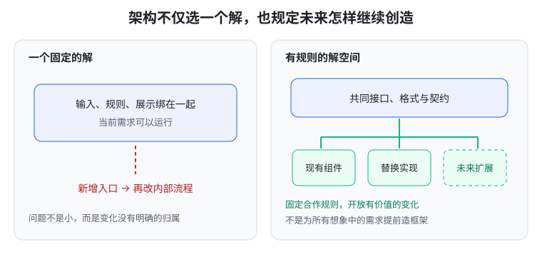
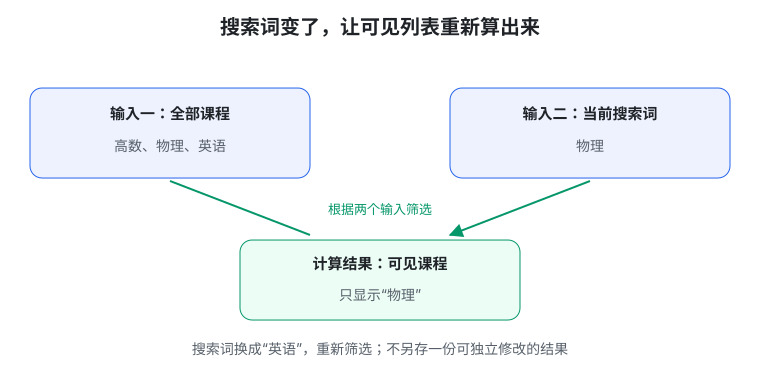
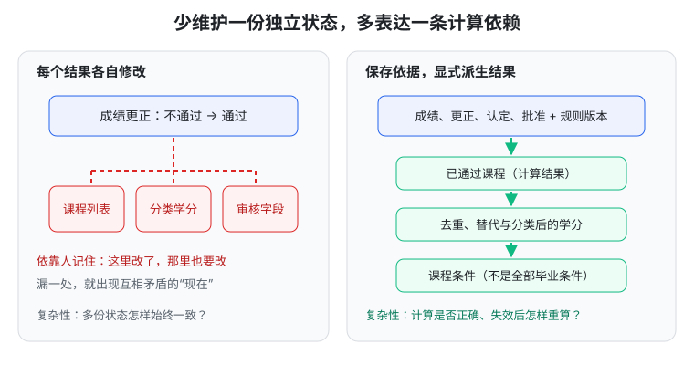

# 生成式软件工程 07 · 需求和架构（2）

> 先记一句话：**该保存的事实保存好，能计算的结果尽量算出来；需要改变时，让变化有地方可去。**

这篇接着第六篇讨论两个问题：怎样让系统越改越不乱？怎样避免修改一处后，还要记得改另外五处？

## 1. 有些复杂是业务本身，有些是自己制造的

选课时要检查先修、容量和时间冲突。不用计算机，教务员拿纸笔也得检查。这叫**本质复杂性**：问题本来就有这些要求。

另一些麻烦是我们自己加上的：

- 同一规则复制到三个页面；
- 一个学生信息存五份，更新时漏了一份；
- 不同模块各用一种日期格式。

这叫**附带复杂性**：解决问题的方法，额外制造了麻烦。

好的架构不能让真实业务规则消失，但可以把它们分开处理，并减少重复和互相牵扯。

先用一个简单问题检查设计：**要求改一处，需要跟着改几处？为什么？**

## 2. 抽象：不用每次重新理解全部细节

你使用 `sort()` 排序时，先关心它是否按约定返回结果，不需要每次展开内部算法。

**抽象**就是把内部细节暂时收起来，提供一个清楚的概念和使用约定。像“去图书馆借书”，不必每次都讨论书怎样上架、系统怎样存数据。

但抽象不是起个高级名字。若叫“借书”却会偷偷删除记录，就没有可靠约定。

分层也类似：下面解决一类细节，上面使用它提供的能力。人的脑子一次能精确处理的事情有限，分层让我们不必同时记住所有细节。

### 补充名词：协程

两个人对弈，都要计算一步、交给对方、等待回应再继续。**协程**能暂停并保存“做到哪里”，以后从那里恢复，适合表达这种交替工作。

它解决的是流程组织，不等于自动多核并行。入门先理解“暂停后能接着做”即可。

## 3. 好架构不只做好今天，也允许以后组合

搭积木时，厂商不必预先制造每个人想要的房子，只要积木接口合得上，你就能组合新东西。

软件也可以这样：先规定共同格式与接口，再允许更换或增加部件。这种允许一类方案继续生长的范围，叫**解空间**。



比如笔记内容用 Markdown 保存，网页负责显示。以后换网页样式，不必重写所有笔记。这就是把“内容”和“展示”分开，让变化有归属。

不是预测所有未来需求、提前造巨大框架。先为确实可能发生的变化留边界，再用实际使用判断是否值得。

## 4. UNIX、数据库和 Internet，都提供了共同规则

### UNIX：一个工具的输出，能交给下一个工具

UNIX 是一类操作系统，也形成了小工具协作的风格。工具分别做好一件事，通过约定格式传递数据。

**管道**就是把前一个工具的输出送给后一个工具：

```text
读取书目 → 提取书名 → 让人选择 → 打开选中的书
```

作者不必预先写出所有用途。格式、错误信息和成功状态得说清；若数据里混进装饰文字，下游就可能读错。

### 关系数据库：你问什么，与它怎样存分开

**关系数据库**用表和关系组织资料。**SQL**是一种描述查询或修改的语言。

你问“这个读者借了哪些书”，不用亲自处理磁盘上的每个位置。底层可以优化存储与查找，上层继续表达业务问题。

**事务**把相关操作组织成需要整体成功或失败的一次处理。比如转账，不能只扣一边的钱而没加到另一边。

### Internet：不同网络靠共同规则合作

手机访问网页时，不必知道途中每段网络使用什么设备。各层按规则传递数据，局部变化不一定逼着应用重写。

这三类系统值得学的共同点是：**先做好合作规则，后来者才能创造设计者没想到的用途。**

## 5. MVC：数据规则、展示、输入分开负责

做选课网页时，如果每个页面都独立写一份选课限制，改规则就容易漏。

**MVC**是常见的职责划分方式：

| 部分 | 大白话 | 选课例子 |
| --- | --- | --- |
| Model | 业务数据和规则 | 课程、名额、先修检查 |
| View | 展示结果 | 列表课表、周历课表 |
| Controller | 接收操作，安排处理 | 收到“选课”请求，交给业务部分 |

把列表换成周历，主要改展示；名额规则变化，主要改业务规则。

Model 不是单指数据库表。把所有乱代码放进一个叫 Model 的文件夹，也不会自动变清楚。

## 6. 搜索词也是状态，不一定都要存进数据库

同一份课程列表，搜索词是“数学”和“计算机”时，页面显示不同。

**状态**就是会影响当前行为或显示的信息。课程是业务状态；搜索词、展开哪个菜单，是界面状态。

可以这样表达：

```text
可见课程 = 用搜索词筛选课程列表
页面 = 展示可见课程
```



这里“可见课程”是**派生结果**，由已有输入算出来。若同时独立保存课程列表、搜索词和可见课程，就得记住三份信息怎样同步。

更简单的是：保存必要输入，让结果随输入重新计算。

## 7. MVVM、Vue 和 React：不用手工同步每个角落

**MVVM**在 Model 与 View 之间增加面向界面的 **ViewModel**。你可以把它理解成“页面要用的状态与操作的整理层”。

Vue 和 React 是帮助构建界面的工具：

- Vue 的 `computed` 表达“这个结果由哪些数据算出来”；`v-model` 连接输入框的值与输入更新。
- React 根据当前数据和状态描述界面；更新状态后，再生成下一次界面。

你暂时不用会它们的语法，先抓住共同思想：**告诉程序依赖关系，不要每次变化都靠人记住要改哪些位置。**

React 中某次显示拿到的状态像一张快照。请求更新后，不会把这次已经拿到的变量立即改掉；下一次显示用新状态。它和 Vue 的机制不同，但都在让状态与界面的关系更清楚。

## 8. 记账：别让 AI 逐格猜报表数字

有原始凭证，先确认发生了什么业务，再形成明确记账动作，然后由程序计算各张表。

这有时叫 **LLM as a Compiler，语言模型作为编译器**：AI 像一个翻译员，把人的材料变成程序能检查、执行的表示。

```text
原始材料 → AI 提出记账动作 → 核对与检查
    → 程序执行确定规则 → 生成报表
```

例如支出财务费用 75 元，收到利息 22.07 元，货币资金净变化为 `22.07 - 75 = -52.93` 元。

**复式记账**要求一笔业务在对应账户中记录，并维持借贷平衡等检查。它能抓住某些错误，但分类错了、重复记了一笔，也可能仍然平衡。

因此：程序检查计算与约束，人工或独立核验检查动作是否符合真实凭证。不是 AI 填完数字，表格看起来平就算正确。

## 9. 过去、现在、未来不要混成一个字段

- 过去：付款已经完成，是事实。
- 现在：根据记录算出的余额，是结果。
- 未来：预计收款，是期待。

“打算付款”和“已经付款”不同。“支付后退款”和“从未支付”可能净金额相同，历史却不同。

第六篇的事件溯源，就是保存已发生记录，再计算结果。记错了，可以追加更正，或用新记录抵消原记录的影响，这叫**冲销**；不要偷偷删掉来由。重算余额也不能再次真的付款。

## 10. 教务系统：成绩更正后，让结果沿依赖重新算

假设一门课从不通过改成通过。它可能影响通过课程、分类学分和课程审核。

**依赖关系**就是“这个结果需要哪些输入”。把关系表达清楚：

```text
成绩与认定记录 + 规则
    → 已通过课程 → 分类学分 → 课程条件是否满足
```



课程条件满足，不一定代表毕业设计、资产归还等条件都满足。人工特批也要保存对象、范围与依据，不能只改最终“通过”。

**Source of truth，事实依据**，就是系统计算时应当信任和追溯的基础记录。它不一定是一个文件，可以包括事实、正式决定及相应规则版本。

能算出来的结果尽量由它产生，而不是再给人一份独立编辑入口。

## 11. 从“记得同步”，变成“检查计算”

原来的困难：改了成绩，还要记得改课程列表、学分和审核字段。

新的困难：输入保留好，再检查计算规则与更新机制是否正确。

后者通常更容易处理：可以重复运行、用样例测试，也能追问结果来自哪里。

为了速度，可以保存算好的结果，这叫**缓存**。缓存要知道什么时候过期、怎样重新生成；不是存下来就永远正确。

SQL 也能表达查询、视图和部分约束。这里不是说数据库不会计算，而是要管理跨数据库、程序、缓存与页面的整条依赖链。关系画出来以后，还需要实际实现更新和检查。

## 动手试一次：看自己的知识库

下面是把本篇思想应用到知识库的练习：

- 笔记文件和真实目录是基础资料；
- 网站列表、文章目录、关系图是生成结果；
- 搜索词、当前文章和缩放是界面状态；
- `dist/` 是构建输出，像打印稿，不应直接修改它来改原资料。

挑一个重复保存的结果，问它能否从基础资料重新生成。让 AI 列出依赖，再用文件和实际构建结果核对。

## 本篇记住这四点

1. 业务自带的复杂性不能消失，实现制造的重复可以减少。
2. 抽象和共同规则，让我们不用每次展开全部细节。
3. 界面和业务结果尽量从明确输入计算，不靠手工同步。
4. 保存事实与决定，结果才有来由，出错才有重算和检查的机会。

## 资料来源

依据[第 7 讲官方讲义](https://jyywiki.cn/GSE/2026/lect7.md)整理，核对日期：2026-10-01。延伸阅读：[React 入门思路](https://react.dev/learn/thinking-in-react)、[Vue 计算属性](https://vuejs.org/guide/essentials/computed.html)、[事件溯源](https://martinfowler.com/eaaDev/EventSourcing.html)。图解与练习为学习整理；原课程材料权利归作者，课程网站标注 CC BY-NC 4.0。
